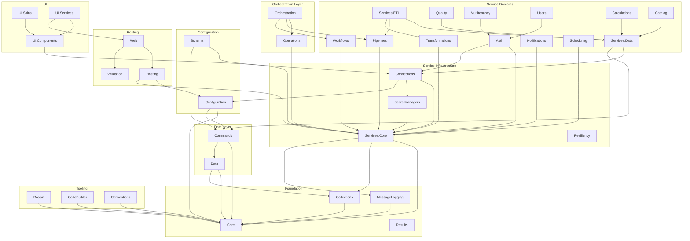

# FractalDataWorks Domain Grouping

This document maps every project in `src/` to a logical domain and describes the dependency relationships between domains.

> **Verification note (1.3):** the headline counts in the table below
> ("197 projects across 43 domains") are stale — `public/src/` now contains
> ~374 project directories. The individual project names listed in each
> domain section have been spot-checked and remain accurate, but several
> domains have grown new sub-packages (Wave 2-5 additions: Operations,
> Workflows, Authorization, Notifications, Schema, UI variants) that are
> not enumerated here. Use this document for domain intent and dependency
> shape; use `ls public/src/` for the authoritative project list.

## Domain Overview

| # | Domain | Projects | Description |
|---|--------|----------|-------------|
| 1 | **Core** | 8 | Foundation types, abstractions, results, expressions |
| 2 | **Collections** | 4 | TypeCollection system and tooling |
| 3 | **MessageLogging** | 2 | Structured logging source generator |
| 4 | **Data** | 22 | Data models, RowSources, serialization, lineage |
| 5 | **Commands** | 5 | Uniform command interface with implementation-specific translators (data, development tools) |
| 6 | **Services.Core** | 5 | Service base types, analyzers, execution |
| 7 | **Services.Connections** | 9 | Connection management (MsSql, PostgreSql, Http) |
| 8 | **Services.Data** | 6 | DataStores, DataSets, DataGateway service layer |
| 9 | **Services.Auth** | 13 | Authentication (JWT, SQL) and Authorization (RBAC) |
| 10 | **Services.SecretManagers** | 6 | Secret storage (Env, KeyVault, MsSql, UserSecrets) |
| 11 | **Services.ETL** | 8 | ETL pipelines, mappers, scheduling |
| 12 | **Services.Pipelines** | 5 | Pipeline orchestration |
| 13 | **Services.Transformations** | 8 | Data transformations (calc, agg, pivot, lookup, cleaning) |
| 14 | **Services.Quality** | 5 | Data quality checks |
| 15 | **Services.Notifications** | 5 | Notification channels (webhook, email, console) |
| 16 | **Services.Multitenancy** | 5 | Tenant isolation and management |
| 17 | **Services.Users** | 5 | User management |
| 18 | **Services.Scheduling** | 5 | Schedule management |
| 19 | **Services.Calculations** | 2 | Calculation services |
| 20 | **Services.Catalog** | 3 | Service catalog |
| 21 | **Services.Workflows** | 2 | Workflow orchestration |
| 22 | **Services.Resiliency** | 4 | Rate limiting and resiliency |
| 23 | **Operations** | 5 | Execution tracking, events, escalation |
| 24 | **Orchestration** | 6 | Pipeline and workflow orchestration |
| 25 | **Configuration** | 10 | ManagedConfiguration, writers, config source |
| 26 | **Schema** | 7 | Schema discovery, DDL generation |
| 27 | **Hosting** | 4 | Server bootstrap, DI registration |
| 28 | **Web** | 14 | API base, endpoints, HTTP clients, search, analytics |
| 29 | **Validation** | 3 | Validation framework, FastEndpoints integration |
| 30 | **UI.Components** | 6 | Headless Blazor components, TUI, RazorConsole |
| 31 | **UI.Skins** | 3 | MudBlazor, Tailwind, Authentication skins |
| 32 | **UI.Services** | 9 | UI-specific clients, themes, pipelines, lineage |
| 33 | **Calculations** | 6 | Calculation engine, aggregations, endpoints |
| 34 | **CodeBuilder** | 4 | Code generation utilities |
| 35 | **Roslyn** | 12 | Roslyn workspace commands |
| 36 | **Conventions** | 3 | Code convention analyzers |
| 37 | **Workspace** | 2 | Workspace management (Roslyn) |
| 38 | **AUI** | 2 | Agent UI framework |
| 39 | **TUI** | 2 | Terminal UI |
| 40 | **SignalR** | 1 | SignalR hub abstractions |
| 41 | **Intelligence** | 1 | AI/ML integration |
| 42 | **Security** | 1 | Hashing utilities |
| 43 | **Types** | 2 | Database type mappings |

**Total: 197 projects across 43 domains**

---

## Project-to-Domain Mapping

### 1. Core

| Project | Purpose |
|---------|---------|
| `Fdw.Abstractions` | Root interfaces and base types |
| `Fdw.Data` | Core data types (FilterOperators, SortDirections) |
| `Fdw.Data.Abstractions` | Data model interfaces |
| `Fdw.Results` | GenericResult, GenericMessage |
| `Fdw.Results.Abstractions` | IGenericResult, IGenericMessage interfaces |
| `Fdw.Messages` | Message infrastructure |
| `Fdw.Expressions` | Expression tree utilities |
| `Fdw.Processors.Abstractions` | Processor pipeline interfaces |

### 2. Collections

| Project | Purpose |
|---------|---------|
| `Fdw.Collections` | TypeCollection base classes, CRTP pattern |
| `Fdw.Collections.Analyzers` | TypeCollection analyzer rules |
| `Fdw.Collections.CodeFixes` | Auto-fixes for TypeCollection violations |
| `Fdw.Collections.SourceGenerators` | TypeCollection source generator |

### 3. MessageLogging

| Project | Purpose |
|---------|---------|
| `Fdw.MessageLogging.Abstractions` | MessageLogging attribute, interfaces |
| `Fdw.MessageLogging.SourceGenerators` | MessageLogging source generator |

### 4. Data

| Project | Purpose |
|---------|---------|
| `Fdw.Data.Builders` | Fluent data builders |
| `Fdw.Data.DataContainers.Abstractions` | Container interfaces |
| `Fdw.Data.DataSets` | DataSet implementation |
| `Fdw.Data.DataSets.Abstractions` | DataSet interfaces |
| `Fdw.Data.DataStores.Abstractions` | DataStore interfaces |
| `Fdw.Data.DataStores.Rest` | REST DataStore implementation |
| `Fdw.Data.DataStores.SqlServer` | SQL Server DataStore |
| `Fdw.Data.Files` | File-based data access |
| `Fdw.Data.Http` | HTTP data access |
| `Fdw.Data.Importers.Abstractions` | Data import interfaces |
| `Fdw.Data.JsonSchema` | JSON Schema support |
| `Fdw.Data.Lineage` | Data lineage graph |
| `Fdw.Data.MsSql` | SQL Server data utilities |
| `Fdw.Data.OData` | OData protocol support |
| `Fdw.Data.OpenApi` | OpenAPI schema mapping |
| `Fdw.Data.RowSources` | RowSource base |
| `Fdw.Data.RowSources.Abstractions` | RowSource interfaces |
| `Fdw.Data.RowSources.DataReader` | ADO.NET DataReader RowSource |
| `Fdw.Data.RowSources.DataReader.Abstractions` | DataReader interfaces |
| `Fdw.Data.RowSources.Http` | HTTP RowSource |
| `Fdw.Data.RowSources.Http.Abstractions` | HTTP RowSource interfaces |
| `Fdw.Data.RowSources.Json` | JSON RowSource |
| `Fdw.Data.RowSources.Json.Abstractions` | JSON RowSource interfaces |
| `Fdw.Data.RowSources.Xml` | XML RowSource |
| `Fdw.Data.RowSources.Xml.Abstractions` | XML RowSource interfaces |
| `Fdw.Data.Serialization` | Serialization utilities |
| `Fdw.Data.SourceGenerators` | Data source generators |
| `Fdw.Data.Transformations` | Data transformation types |
| `Fdw.Data.Transformations.Abstractions` | Transformation interfaces |
| `Fdw.Data.Transformers.Abstractions` | Transformer interfaces |

### 5. Commands

| Project | Purpose |
|---------|---------|
| `Fdw.Commands.Abstractions` | Core framework: CommandTypes, CommandCategories, TranslatorTypes, clauses, cost estimation |
| `Fdw.Commands.Data` | Data commands: QueryCommand, InsertCommand, UpdateCommand, DeleteCommand |
| `Fdw.Commands.Data.Abstractions` | Data command interfaces, IDataGateway |
| `Fdw.Commands.Data.Extensions` | Fluent data command builder extensions |
| `Fdw.Commands.Development.Abstractions` | Development commands: 9 categories (Analysis, CodeSearch, Compilation, Formatting, Generation, Navigation, Project, Refactoring, Workspace) |

### 6. Services.Core

| Project | Purpose |
|---------|---------|
| `Fdw.Services` | Service base types, registration |
| `Fdw.Services.Abstractions` | Service interfaces |
| `Fdw.Services.Execution.Abstractions` | IExecutionTracker interfaces |
| `Fdw.ServiceTypes.Analyzers` | ServiceType analyzer rules |
| `Fdw.ServiceTypes.CodeFixes` | ServiceType code fixes |

### 7. Services.Connections

| Project | Purpose |
|---------|---------|
| `Fdw.Services.Connections` | ConnectionTypes, DefaultConnectionProvider |
| `Fdw.Services.Connections.Abstractions` | IConnection, IConnectionConfiguration |
| `Fdw.Services.Connections.Clients` | ConnectionHttpClient |
| `Fdw.Services.Connections.Clients.Abstractions` | IConnectionClient |
| `Fdw.Services.Connections.Endpoints` | Connection API endpoints |
| `Fdw.Services.Connections.Http` | HTTP connection implementation |
| `Fdw.Services.Connections.Http.Abstractions` | HTTP connection interfaces |
| `Fdw.Services.Connections.MsSql` | SQL Server connection |
| `Fdw.Services.Connections.PostgreSql` | PostgreSQL connection |

### 8. Services.Data

| Project | Purpose |
|---------|---------|
| `Fdw.Services.Data` | DataStoreServiceTypes, DataSetServiceTypes |
| `Fdw.Services.Data.Abstractions` | IDataStore, IDataSet interfaces |
| `Fdw.Services.Data.Clients` | DataStore/DataSet HTTP clients |
| `Fdw.Services.Data.Clients.Models` | Client DTO models |
| `Fdw.Services.Data.Endpoints` | Data service API endpoints |
| `Fdw.Services.Data.SignalR` | Real-time data notifications |

### 9. Services.Auth

| Project | Purpose |
|---------|---------|
| `Fdw.Services.Authentication` | AuthenticationServiceTypes collection |
| `Fdw.Services.Authentication.Abstractions` | IAuthentication interfaces |
| `Fdw.Services.Authentication.Clients` | Auth HTTP client |
| `Fdw.Services.Authentication.Clients.Abstractions` | Auth client interfaces |
| `Fdw.Services.Authentication.Endpoints` | Auth API endpoints |
| `Fdw.Services.Authentication.Jwt` | JWT authentication implementation |
| `Fdw.Services.Authentication.Jwt.MsSql` | JWT with SQL Server storage |
| `Fdw.Services.Credentials` | Credential service domain (named indirection over the vault) |
| `Fdw.Services.Credentials.Sql` | SQL credential service (vault-backed PAT + agent key) |
| `Fdw.Services.Authorization` | AuthorizationTypes, RBAC bridge |
| `Fdw.Services.Authorization.Abstractions` | IAuthorization interfaces |
| `Fdw.Services.Authorization.Clients` | Authorization HTTP client |
| `Fdw.Services.Authorization.Clients.Abstractions` | Authorization client interfaces |
| `Fdw.Services.Authorization.Endpoints` | Authorization API endpoints |

### 10. Services.SecretManagers

| Project | Purpose |
|---------|---------|
| `Fdw.Services.SecretManagers` | SecretManagerTypes collection |
| `Fdw.Services.SecretManagers.Abstractions` | ISecretManager interfaces |
| `Fdw.Services.SecretManagers.AzureKeyVault` | Azure Key Vault implementation |
| `Fdw.Services.SecretManagers.EnvironmentVariable` | Environment variable secrets |
| `Fdw.Services.SecretManagers.MsSql` | SQL Server-stored secrets |
| `Fdw.Services.SecretManagers.UserSecrets` | .NET User Secrets integration |

### 11. Services.ETL

| Project | Purpose |
|---------|---------|
| `Fdw.Services.Etl` | ETL service types |
| `Fdw.Services.Etl.Abstractions` | ETL interfaces, TransformTypes |
| `Fdw.Services.EtlMappers` | ETL field mappers |
| `Fdw.Services.EtlMappers.Abstractions` | Mapper interfaces |
| `Fdw.Services.EtlMappers.Dynamic` | Dynamic mapper |
| `Fdw.Services.EtlMappers.Pooled` | Pooled mapper |
| `Fdw.Etl.Abstractions` | Core ETL interfaces |
| `Fdw.Etl.Pipelines` | Pipeline execution |

### 12. Services.Pipelines

| Project | Purpose |
|---------|---------|
| `Fdw.Services.Pipelines` | Pipeline service types |
| `Fdw.Services.Pipelines.Abstractions` | Pipeline interfaces |
| `Fdw.Services.Pipelines.Clients` | Pipeline HTTP client |
| `Fdw.Services.Pipelines.Clients.Abstractions` | Pipeline client interfaces |
| `Fdw.Services.Pipelines.Endpoints` | Pipeline API endpoints |

### 13. Services.Transformations

| Project | Purpose |
|---------|---------|
| `Fdw.Services.Transformations` | TransformationTypes collection |
| `Fdw.Services.Transformations.Abstractions` | Transformation interfaces |
| `Fdw.Services.Transformations.Aggregation` | Aggregation transformations |
| `Fdw.Services.Transformations.Calculation` | Calculation transformations |
| `Fdw.Services.Transformations.DataCleaning` | Data cleaning transforms |
| `Fdw.Services.Transformations.DataCleaning.Abstractions` | Cleaning interfaces |
| `Fdw.Services.Transformations.Lookup` | Lookup transformations |
| `Fdw.Services.Transformations.Pivot` | Pivot transformations |

### 14. Services.Quality

| Project | Purpose |
|---------|---------|
| `Fdw.Services.Quality` | Quality check types |
| `Fdw.Services.Quality.Abstractions` | Quality interfaces |
| `Fdw.Services.Quality.Clients` | Quality HTTP client |
| `Fdw.Services.Quality.Clients.Abstractions` | Quality client interfaces |
| `Fdw.Services.Quality.Endpoints` | Quality API endpoints |

### 15. Services.Notifications

| Project | Purpose |
|---------|---------|
| `Fdw.Services.Notifications` | NotificationTypes collection |
| `Fdw.Services.Notifications.Abstractions` | INotification interfaces |
| `Fdw.Services.Notifications.Console` | Console notification channel |
| `Fdw.Services.Notifications.Email` | Email notification channel |
| `Fdw.Services.Notifications.Webhook` | Webhook notification channel |

### 16. Services.Multitenancy

| Project | Purpose |
|---------|---------|
| `Fdw.Services.Multitenancy.Abstractions` | Tenant interfaces |
| `Fdw.Services.Multitenancy.Clients` | Tenant HTTP client |
| `Fdw.Services.Multitenancy.Clients.Abstractions` | Tenant client interfaces |
| `Fdw.Services.Multitenancy.Endpoints` | Tenant API endpoints |
| `Fdw.Services.Multitenancy.Sql` | SQL tenant middleware |

### 17. Services.Users

| Project | Purpose |
|---------|---------|
| `Fdw.Services.Users` | User service types |
| `Fdw.Services.Users.Abstractions` | User interfaces |
| `Fdw.Services.Users.Clients` | User HTTP client |
| `Fdw.Services.Users.Clients.Abstractions` | User client interfaces |
| `Fdw.Services.Users.Endpoints` | User API endpoints |

### 18. Services.Scheduling

| Project | Purpose |
|---------|---------|
| `Fdw.Services.Scheduling` | Schedule service types |
| `Fdw.Services.Scheduling.Abstractions` | Schedule interfaces |
| `Fdw.Services.Scheduling.Clients` | Schedule HTTP client |
| `Fdw.Services.Scheduling.Clients.Abstractions` | Schedule client interfaces |
| `Fdw.Services.Scheduling.Endpoints` | Schedule API endpoints |

### 19. Services.Calculations

| Project | Purpose |
|---------|---------|
| `Fdw.Services.Calculations` | Calculation service types |
| `Fdw.Services.Calculations.Abstractions` | Calculation service interfaces |

### 20. Services.Catalog

| Project | Purpose |
|---------|---------|
| `Fdw.Services.Catalog.Clients` | Catalog HTTP client |
| `Fdw.Services.Catalog.Clients.Models` | Catalog client DTO models |
| `Fdw.Services.Catalog.Endpoints` | Catalog API endpoints |

### 21. Services.Workflows

| Project | Purpose |
|---------|---------|
| `Fdw.Services.Workflows` | Workflow service types |
| `Fdw.Services.Workflows.Abstractions` | Workflow interfaces |

### 22. Services.Resiliency

| Project | Purpose |
|---------|---------|
| `Fdw.Services.RateLimiting` | Rate limiting implementation |
| `Fdw.Services.RateLimiting.Abstractions` | Rate limiting interfaces |
| `Fdw.Services.Resiliency` | Retry, circuit breaker |
| `Fdw.Services.Resiliency.Abstractions` | Resiliency interfaces |

### 23. Operations

| Project | Purpose |
|---------|---------|
| `Fdw.Operations` | Execution tracking, escalation |
| `Fdw.Operations.Abstractions` | IExecutionItem, IEscalation |
| `Fdw.Operations.Clients` | Operations HTTP client |
| `Fdw.Operations.Clients.Abstractions` | Operations client interfaces |
| `Fdw.Operations.Endpoints` | Operations API endpoints |

### 24. Orchestration

| Project | Purpose |
|---------|---------|
| `Fdw.Orchestration` | Orchestration engine |
| `Fdw.Orchestration.Abstractions` | Orchestration interfaces |
| `Fdw.Orchestration.Pipelines` | Pipeline orchestration |
| `Fdw.Orchestration.Pipelines.Abstractions` | Pipeline orchestration interfaces |
| `Fdw.Orchestration.Workflows` | Workflow orchestration |
| `Fdw.Orchestration.Workflows.Abstractions` | Workflow orchestration interfaces |

### 25. Configuration

| Project | Purpose |
|---------|---------|
| `Fdw.Configuration` | ManagedConfiguration, config source |
| `Fdw.Configuration.Abstractions` | Config interfaces |
| `Fdw.Configuration.Endpoints` | Config API endpoints |
| `Fdw.Configuration.MsSql` | MsSqlConfigurationSource |
| `Fdw.Configuration.SourceGenerators` | ManagedConfiguration generator |
| `Fdw.Configuration.UI.SourceGenerators` | Config UI generator |
| `Fdw.Configuration.Writers` | IConfigurationWriter |
| `Fdw.Configuration.Writers.Abstractions` | Writer interfaces |
| `Fdw.Configuration.Writers.InMemory` | In-memory config writer |
| `Fdw.Configuration.Writers.MsSql` | SQL Server config writer |

### 26. Schema

| Project | Purpose |
|---------|---------|
| `Fdw.Schema.Abstractions` | Schema model interfaces |
| `Fdw.Schema.Clients` | Schema HTTP client |
| `Fdw.Schema.Clients.Abstractions` | Schema client interfaces |
| `Fdw.Schema.Ddl` | DDL generation |
| `Fdw.Schema.Ddl.MsSql` | SQL Server DDL |
| `Fdw.Schema.Ddl.Tasks` | DDL task runner |
| `Fdw.Schema.Endpoints` | Schema API endpoints |

### 27. Hosting

| Project | Purpose |
|---------|---------|
| `Fdw.Hosting` | AddFramework*, UseFramework* extensions |
| `Fdw.Hosting.Abstractions` | Hosting interfaces |
| `Fdw.Hosting.Bootstrap.Configuration` | Bootstrap configuration binding |
| `Fdw.Hosting.MsSql` | SQL Server hosting (MsSqlConfigurationSource) |

### 28. Web

| Project | Purpose |
|---------|---------|
| `Fdw.Web.Api` | API base classes |
| `Fdw.Web.Endpoints` | FastEndpoints base |
| `Fdw.Web.RestEndpoints` | REST endpoint conventions |
| `Fdw.Web.Clients.Abstractions` | Cross-domain DTO contracts |
| `Fdw.Web.Clients.Wasm` | WASM HTTP client |
| `Fdw.Web.Http.Abstractions` | HTTP abstractions |
| `Fdw.Web.Http.Authentication` | HTTP auth middleware |
| `Fdw.Web.Http.Authentication.Blazor` | Blazor auth handler |
| `Fdw.Web.Http.Authentication.OpenIdConnect` | OIDC integration |
| `Fdw.Web.Http.Authentication.Wasm` | WASM auth handler |
| `Fdw.Web.Analytics.Clients` | Analytics HTTP client |
| `Fdw.Web.Analytics.Clients.Abstractions` | Analytics interfaces |
| `Fdw.Web.Search.Clients` | Search HTTP client |
| `Fdw.Web.Search.Clients.Models` | Search client DTO models |
| `Fdw.Web.Search.Endpoints` | Search API endpoints |
| `Fdw.Web.Calculations.Clients` | Calculation HTTP client |
| `Fdw.Web.Calculations.Clients.Abstractions` | Calculation client interfaces |

### 29. Validation

| Project | Purpose |
|---------|---------|
| `Fdw.Validation` | Validation engine |
| `Fdw.Validation.Abstractions` | Validation interfaces |
| `Fdw.Validation.FastEndpoints` | FastEndpoints validator integration |

### 30. UI.Components

| Project | Purpose |
|---------|---------|
| `Fdw.UI.Abstractions` | UI interfaces |
| `Fdw.UI.Components` | Headless Blazor components |
| `Fdw.UI.Components.Blazor` | Blazor-specific component implementations |
| `Fdw.UI.Components.Blazor.MsSql` | MsSql-specific UI components |
| `Fdw.UI.Components.RazorConsole` | Razor console components |
| `Fdw.UI.Components.RazorConsole.SourceGenerators` | Console generators |
| `Fdw.UI.Components.TUI` | Terminal UI components |

### 31. UI.Skins

| Project | Purpose |
|---------|---------|
| `Fdw.UI.Blazor.MudBlazor` | MudBlazor skin |
| `Fdw.UI.Blazor.Tailwind` | Tailwind CSS skin |
| `Fdw.UI.Blazor.Authentication` | Auth UI skin |

### 32. UI.Services

| Project | Purpose |
|---------|---------|
| `Fdw.UI.Services` | UI service layer (providers) |
| `Fdw.UI.Web.Abstractions` | UI web interfaces |
| `Fdw.UI.Themes` | Theme engine |
| `Fdw.UI.Themes.Clients` | Theme HTTP client |
| `Fdw.UI.Themes.Clients.Abstractions` | Theme client interfaces |
| `Fdw.UI.Themes.Endpoints` | Theme API endpoints |
| `Fdw.UI.Pipelines.Clients` | Pipeline UI client |
| `Fdw.UI.Pipelines.Clients.Models` | Pipeline UI DTO models |
| `Fdw.UI.Pipelines.Endpoints` | Pipeline UI endpoints |
| `Fdw.UI.Schema.Clients.Abstractions` | Schema UI interfaces |
| `Fdw.UI.Lineage.Clients.Abstractions` | Lineage UI interfaces |
| `Fdw.UI.Rendering.Spectre` | Spectre.Console rendering |

### 33. Calculations

| Project | Purpose |
|---------|---------|
| `Fdw.Calculations` | Calculation engine |
| `Fdw.Calculations.Abstractions` | Calculation interfaces |
| `Fdw.Calculations.Aggregations` | Aggregation functions |
| `Fdw.Calculations.Contracts` | Calculation contracts |
| `Fdw.Calculations.Endpoints` | Calculation API endpoints |
| `Fdw.Calculations.SignalR` | Real-time calculation updates |

### 34. CodeBuilder

| Project | Purpose |
|---------|---------|
| `Fdw.CodeBuilder.Abstractions` | Code builder interfaces |
| `Fdw.CodeBuilder.Analysis` | Code analysis utilities |
| `Fdw.CodeBuilder.Analysis.CSharp` | C# analysis |
| `Fdw.CodeBuilder.CSharp` | C# code generation |

### 35. Roslyn

| Project | Purpose |
|---------|---------|
| `Fdw.Roslyn.Commands` | Roslyn command base |
| `Fdw.Roslyn.Commands.Abstractions` | Command interfaces |
| `Fdw.Roslyn.Commands.Analysis` | Code analysis commands |
| `Fdw.Roslyn.Commands.Compilation` | Build commands |
| `Fdw.Roslyn.Commands.Conventions` | Convention check commands |
| `Fdw.Roslyn.Commands.Formatting` | Format commands |
| `Fdw.Roslyn.Commands.Generation` | Code gen commands |
| `Fdw.Roslyn.Commands.Navigation` | Navigation commands |
| `Fdw.Roslyn.Commands.Project` | Project management commands |
| `Fdw.Roslyn.Commands.Refactoring` | Refactoring commands |
| `Fdw.Roslyn.Commands.Search` | Search commands |
| `Fdw.Roslyn.Commands.Workspace` | Workspace commands |

### 36. Conventions

| Project | Purpose |
|---------|---------|
| `Fdw.Conventions.Analyzers` | FDW006/007/008 convention analyzers |
| `Fdw.Conventions.CodeFixes` | Convention auto-fixes |
| `Fdw.Conventions.FileSplitter` | One-type-per-file splitter |

### 37-43. Remaining Domains

| Project | Domain |
|---------|--------|
| `Fdw.Workspace.Management` | Workspace |
| `Fdw.Workspace.Roslyn` | Workspace |
| `Fdw.Aui` | AUI |
| `Fdw.Aui.Abstractions` | AUI |
| `Fdw.TUI.Abstractions` | TUI |
| `Fdw.TUI.Management` | TUI |
| `Fdw.SignalR` | SignalR |
| `Fdw.Intelligence` | Intelligence |
| `Fdw.Security.Hashing` | Security |
| `Fdw.Types.Abstractions` | Types |
| `Fdw.Types.MsSql` | Types |
| `Fdw.Analyzers` | Core (analyzers) |
| `Fdw.CodeFixes` | Core (code fixes) |
| `Fdw.SourceGenerators` | Core (generators) |
| `Fdw.Registration.SourceGenerators` | Services.Core (DI gen) |
| `Fdw.Etl.Scheduling` | Services.ETL |
| `Fdw.Services.Terminal.Abstractions` | TUI |

---

## Domain Dependency Diagram

---

## Consolidation Notes

1. **Services.Workflows + Orchestration.Workflows** -- These overlap conceptually. `Services.Workflows` is the service-layer integration while `Orchestration.Workflows` is the engine. Consider whether `OrchestratedWorkflow` bridge can be simplified.

2. **Data.Transformations vs Services.Transformations** -- `Data.Transformations` defines transformation types/interfaces; `Services.Transformations` implements them as service domains. The split is correct (abstractions vs implementations) but the naming could be confusing.

3. **Calculations (standalone) vs Services.Calculations** -- Similar to the transformations split. `Calculations` is the engine; `Services.Calculations` is the service-layer wrapper.

4. **UI.Services could absorb UI.Themes/Pipelines/Schema/Lineage clients** -- These are all UI-specific service clients that follow the same pattern. Currently scattered across many small projects.

5. **Web.Clients.Abstractions** -- Houses cross-domain DTO contracts. This is architecturally important as a dependency inversion point and should NOT be consolidated into any specific domain.

6. **ETL split** -- `Etl.*` (core) vs `Services.Etl.*` (service layer) vs `Services.EtlMappers.*` (field mapping). Three separate concerns, correctly separated.
