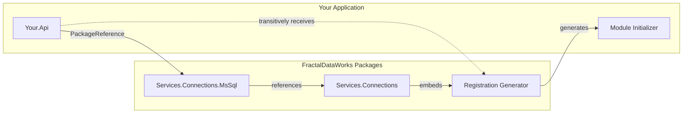

# Package Management

FractalDataWorks uses central package management to control NuGet package versions in one place.

## Directory.Packages.props

From [`samples/ReferenceSolution/Directory.Packages.props`](../samples/ReferenceSolution/Directory.Packages.props):

```xml
<Project>
  <PropertyGroup>
    <ManagePackageVersionsCentrally>true</ManagePackageVersionsCentrally>
  </PropertyGroup>

  <ItemGroup>
    <!-- FractalDataWorks Packages -->
    <PackageVersion Include="Fdw.Abstractions" Version="0.1.0-local" />
    <PackageVersion Include="Fdw.Collections" Version="0.1.0-local" />
    <PackageVersion Include="Fdw.Collections.SourceGenerators" Version="0.1.0-local" />
    <PackageVersion Include="Fdw.MessageLogging" Version="0.1.0-local" />
    <PackageVersion Include="Fdw.MessageLogging.Abstractions" Version="0.1.0-local" />
    <PackageVersion Include="Fdw.MessageLogging.SourceGenerators" Version="0.1.0-local" />
    <PackageVersion Include="Fdw.Results" Version="0.1.0-local" />
    <PackageVersion Include="Fdw.Commands.Data" Version="0.1.0-local" />
    <PackageVersion Include="Fdw.Services.Data" Version="0.1.0-local" />

    <!-- Microsoft -->
    <PackageVersion Include="Microsoft.Extensions.Logging.Abstractions" Version="9.0.0" />
    <PackageVersion Include="Microsoft.Extensions.DependencyInjection" Version="9.0.0" />
    <PackageVersion Include="Microsoft.Extensions.DependencyInjection.Abstractions" Version="9.0.0" />
    <PackageVersion Include="Microsoft.AspNetCore.Components.WebAssembly" Version="10.0.0" />

    <!-- UI -->
    <PackageVersion Include="MudBlazor" Version="9.0.0" />
  </ItemGroup>
</Project>
```

Note: The sample `Directory.Packages.props` does **not** apply analyzer-asset metadata to source generator package versions; that metadata lives on the per-project `PackageReference` (see below).

## Using Packages in Projects

With central package management, project files reference packages without versions.

From [`samples/ReferenceSolution/concepts/01-type-collections/src/Reference.TypeCollections/Reference.TypeCollections.csproj`](../samples/ReferenceSolution/concepts/01-type-collections/src/Reference.TypeCollections/Reference.TypeCollections.csproj):

```xml
<Project Sdk="Microsoft.NET.Sdk">

  <PropertyGroup>
    <OutputType>Exe</OutputType>
    <TargetFramework>net10.0</TargetFramework>
    <ImplicitUsings>disable</ImplicitUsings>
    <Nullable>enable</Nullable>
    <LangVersion>preview</LangVersion>
  </PropertyGroup>

  <ItemGroup>
    <PackageReference Include="Fdw.Collections" />
    <PackageReference Include="Fdw.Collections.SourceGenerators" OutputItemType="Analyzer" ReferenceOutputAssembly="false" />
  </ItemGroup>

</Project>
```

## Source Generator Configuration

Source generators require special asset configuration to prevent them from being included as runtime dependencies.

Apply analyzer asset metadata on the per-project `PackageReference` (the sample `Directory.Packages.props` does not centralize this):

```xml
<PackageReference Include="Fdw.Collections.SourceGenerators"
                  OutputItemType="Analyzer"
                  ReferenceOutputAssembly="false" />
```

### TypeCollection Source Generators

Two source generator packages work together for TypeCollections:

| Package | Purpose | When to Use |
|---------|---------|-------------|
| `Collections.SourceGenerators` | Generates collection implementations | Defining `[TypeCollection]` classes |
| `Registration.SourceGenerators` | Generates module initializers | Defining `[TypeOption]`, `[ServiceTypeOption]`, or `[GenerateMapper]` in separate assemblies |

**Projects defining TypeCollections** need the full generator:

```xml
<PackageReference Include="Fdw.Collections.SourceGenerators">
  <IncludeAssets>runtime; build; native; contentfiles; analyzers</IncludeAssets>
  <PrivateAssets>all</PrivateAssets>
</PackageReference>
```

**Projects defining only TypeOptions** (extending existing collections) need only the Registration generator:

```xml
<PackageReference Include="Fdw.Registration.SourceGenerators">
  <IncludeAssets>runtime; build; native; contentfiles; analyzers</IncludeAssets>
  <PrivateAssets>all</PrivateAssets>
</PackageReference>
```

**Consumer projects** typically need neither - service packages like `Services.Connections` embed the Registration generator, so it flows transitively to consumers who add custom TypeOptions.

### POCO Mapper Source Generator

Projects that use `[GenerateMapper]` on POCO classes need the `Data.SourceGenerators` package as an Analyzer. This generator creates strongly-typed mappers that eliminate reflection when mapping `DbDataReader` rows to POCO objects via the DataGateway.

**Two things are required:**

1. **The project containing the POCO** must reference `Data.SourceGenerators` as an Analyzer — this generates the mapper class
2. **The entry project** (e.g., your API host) must reference `Registration.SourceGenerators` — this generates the module initializer that registers the mapper into `PocoMapperCollection` at startup

```xml
<!-- In the project that defines the POCO -->
<PackageReference Include="Fdw.Data" />
<PackageReference Include="Fdw.Data.SourceGenerators"
                  OutputItemType="Analyzer"
                  ReferenceOutputAssembly="false" />
```

```csharp
using Fdw.Data;

[GenerateMapper]
public sealed class MyQueryRecord
{
    public Guid Id { get; set; }
    public string Name { get; set; } = string.Empty;
}
```

**Without `Data.SourceGenerators` as an Analyzer, the `[GenerateMapper]` attribute has no effect** — no mapper is generated and DataGateway will fail at runtime with "No POCO mapper found for type 'X'".

POCO property names must match the database column names exactly. The DataGateway Insert/Query builders generate SQL parameter names from POCO properties, and column names from DataSet field mappings — a mismatch causes SQL parameter errors at runtime.

### Transitive Generator Flow

The Registration generator handles **cross-assembly registration** via module initializers for `[TypeOption]`, `[ServiceTypeOption]`, and `[GenerateMapper]` types:



When your app references `Services.Connections.MsSql`:
1. NuGet restores MsSql and its dependencies (including Services.Connections)
2. The Registration generator embedded in Services.Connections flows to your project
3. The generator scans for `[ServiceTypeOption]` types in referenced assemblies
4. It generates a module initializer in YOUR assembly:

```csharp
// Generated in your application
[ModuleInitializer]
internal static void RegisterServiceTypeOptions()
{
    ConnectionTypes.RegisterMember(new MsSqlConnectionType());
}
```

This runs before `Main()`, ensuring all ServiceTypes are registered before `ConnectionTypes.All()` or `ConnectionTypes.ConfigureAll()` is called.

## Package Sources

Example local `nuget.config` (generated by `setup-local-nuget.*` in `$LocalNugetFolder`):

```xml
<?xml version="1.0" encoding="utf-8"?>
<configuration>
  <packageSources>
    <clear />
    <add key="LocalFdw" value="<your-local-nuget-path>" />
    <add key="nuget.org" value="https://api.nuget.org/v3/index.json" />
  </packageSources>

  <packageSourceMapping>
    <packageSource key="LocalFdw">
      <package pattern="FractalDataWorks.*" />
    </packageSource>
    <packageSource key="nuget.org">
      <package pattern="*" />
    </packageSource>
  </packageSourceMapping>
</configuration>
```

Replace `<your-local-nuget-path>` with the absolute path to your local NuGet feed (e.g., `~/development/local-nuget`). The `packageSourceMapping` section ensures FractalDataWorks packages come from the local feed, while all other packages use nuget.org.

## Per-Domain Endpoint Packages

FractalDataWorks distributes API endpoints as 21 per-domain NuGet packages. Each package contains generic base endpoint classes and shared DTOs that consumers close with concrete types (thin closure pattern). (The shared `Fdw.Web.Endpoints` base is transitively included, not a per-domain package.)

| Package | Domain |
|---------|--------|
| `Fdw.Services.Connections.Endpoints` | Connection CRUD + test |
| `Fdw.Services.Data.Endpoints` | DataStores, DataSets, Containers |
| `Fdw.Services.Pipelines.Endpoints` | Pipeline status |
| `Fdw.Services.Scheduling.Endpoints` | Schedule management |
| `Fdw.Services.Users.Endpoints` | User CRUD |
| `Fdw.Services.Authorization.Endpoints` | Roles, permissions |
| `Fdw.Services.Multitenancy.Endpoints` | Tenant management |
| `Fdw.Services.Quality.Endpoints` | Data quality rules |
| `Fdw.Services.Catalog.Endpoints` | Glossary, annotations |
| `Fdw.Operations.Endpoints` | Executions, dataflow, config metadata |
| `Fdw.Schema.Endpoints` | Schema discovery |
| `Fdw.Web.Search.Endpoints` | Full-text search |
| `Fdw.UI.Themes.Endpoints` | Theme CRUD |
| `Fdw.Services.Authentication.Endpoints` | Authentication (login, refresh, logout, user info) |
| `Fdw.Calculations.Endpoints` | Calculation execution and type listing |
| `Fdw.Configuration.Endpoints` | Configuration metadata |
| `Fdw.Services.Messaging.Endpoints` | Messaging |
| `Fdw.Services.Notifications.Endpoints` | Notification channels |
| `Fdw.Services.SecretManagers.Endpoints` | Secret managers |
| `Fdw.Services.Settings.Endpoints` | Settings |
| `Fdw.UI.Pipelines.Endpoints` | Pipeline designer (UI) |

Each endpoint package transitively includes `Web.RestEndpoints` and `Web.Endpoints`. Consumers reference only the domains they need:

```xml
<PackageReference Include="Fdw.Services.Connections.Endpoints" />
<PackageReference Include="Fdw.Services.Data.Endpoints" />
```

See [API Endpoints](12-07-API-Endpoints.md) and [Customizing Endpoints](12-08-Customizing-Endpoints.md) for usage details.

## Next Steps

- [Naming Conventions](02-04-Naming-Conventions.md) - Project naming patterns
