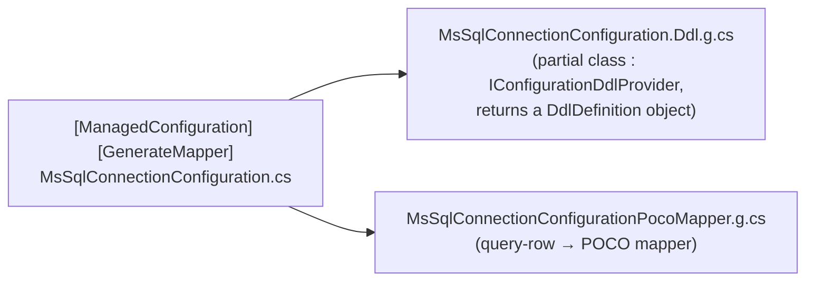
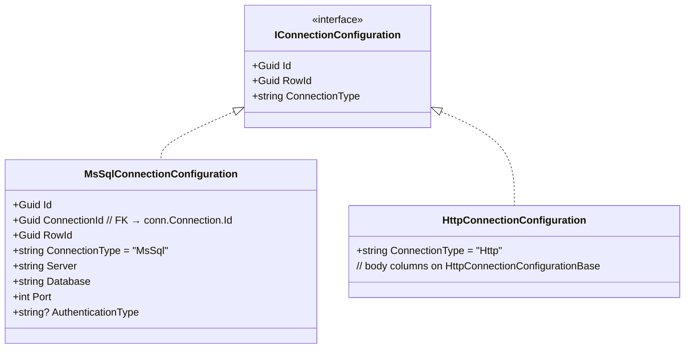
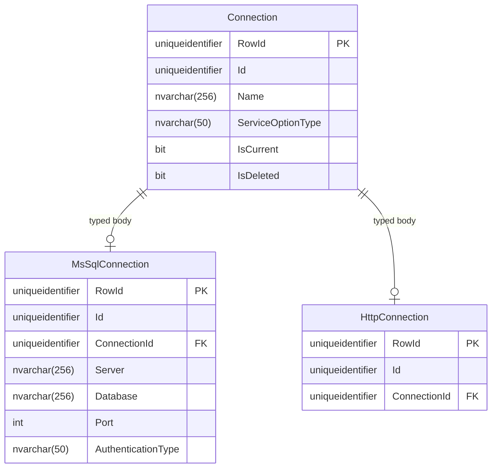

# ManagedConfiguration

ManagedConfiguration is FractalDataWorks' pattern for database-persisted, source-generated configuration. It bridges compile-time type safety with runtime database-driven configuration.

## Overview

The `[ManagedConfiguration]` attribute marks a POCO for:
- **DDL generation** — a C# `DdlDefinition` object model describing the table, columns, and version-on-write keys.
- **POCO mapper generation** — a `*PocoMapper.g.cs` that maps query rows to the configuration instance.

The attribute lives in the `Fdw.Configuration` namespace and is emitted by
`Fdw.Configuration.SourceGenerators`. It carries **discriminator and UI-generation
metadata only** — it does **not** carry the schema, table name, or parent table. Structural
metadata (schema, table, parent relationships) is owned by the `IDataNode` / `IDataContainer`
object model, not the attribute.

### Attribute shape

```csharp
public sealed class ManagedConfigurationAttribute : Attribute
{
    public string? DisplayName { get; set; }      // UI display name
    public string? Description { get; set; }       // UI help text
    public string? ServiceCategory { get; set; }   // e.g. "Connection" (inferred from class-name suffix if unset)
    public string? ServiceType { get; set; }       // e.g. "MsSql" (inferred from class-name prefix if unset)
    public bool GenerateDdl { get; set; } = true;
    public bool GenerateValidator { get; set; } = true;
    public bool GenerateUi { get; set; } = true;
    public string OnDelete { get; set; } = "Cascade";        // Cascade | SetNull | NoAction
    public string DatabaseProvider { get; set; } = "MsSql";  // MsSql | PostgreSql
}
```

There is **no `Schema`, `TableName`, or `ParentTableName`** property. Real usage is just the two
discriminators:

```csharp
[ManagedConfiguration(ServiceCategory = "Connection", ServiceType = "MsSql")]
```

> **Note on `GenerateValidator`:** the flag exists, but no validator generator is currently
> wired. Validators are hand-written (e.g.
> `MsSqlConnectionConfigurationValidator.cs`). The `ConfigurationTypesGenerator` that once emitted
> `ConfigurationType` classes and a `ConfigurationTypes` collection has been reduced to a
> namespace-helper stub — it generates no per-type classes.

## Architecture Flow

```mermaid
flowchart TB
    subgraph "Compile Time"
        A[Configuration POCO] --> B["[ManagedConfiguration] + [GenerateMapper]"]
        B --> C[Configuration.SourceGenerators]
        B --> M[Data.SourceGenerators]
        C --> D["*.Ddl.g.cs (DdlDefinition object model)"]
        M --> E["*PocoMapper.g.cs (row → POCO mapper)"]
    end

    subgraph "Shipped schema (per entry-point app)"
        H[configurationSchema.json] --> I["IConfigurationGateway via AddConfigurationGateway<...>"]
        I --> J[Connection to ConfigurationDb]
    end

    subgraph "Runtime"
        J --> L["Per-domain *ConfigurationProvider"]
        L --> N["IConfigurationGateway → ConfigurationDb domain schema (conn.* / data.* / pipe.*)"]
        N --> O[Configuration instances]
        L --> P[Built-in gateway caching + singleton DataGatewayResultCache (cache + tag invalidation)]
    end
```

## Generation Process

A single `[ManagedConfiguration]` POCO produces exactly two generated files (one per generator):



The DDL generator emits a **C# `DdlDefinition` object model**, not raw `CREATE TABLE` SQL. The
DDL it describes follows the version-on-write pattern: `RowId` is the version-specific physical PK
with a `NEWID()` / `NEWSEQUENTIALID()` default, and `Id` is the durable logical identity. No
`ConfigurationType` class, no `ConfigurationTypes` collection, and no validator class are
generated.

## Parent-child (typed-body) configuration

Multi-variant configuration domains (Connection, Authentication, Pipeline, …) split into a thin
**parent header** plus one **typed body** per variant. The typed body is **not** a subclass of a
generic `ConnectionConfigurationBase<T>` — no such base exists. Each typed body implements the
domain's marker interface directly and carries the FK back to its parent:



- `MsSqlConnectionConfiguration : IConnectionConfiguration` (marker interface, not a base class).
- The REST/HTTP variant is `HttpConnectionConfiguration` — there is **no** `RestConnectionConfiguration`.
- The MsSql auth column is `AuthenticationType` (validated against `MsSqlAuthenticationTypes`), **not** `Authentication`.

### Database schema

The parent header table holds identity-only columns; each typed body holds the columns its
factory reads at runtime, linked by a `{Parent}Id` FK to the parent's logical `Id`:



**Why no hard FK constraint:** under version-on-write the parent's logical `Id` is not unique
(each version is a new `RowId` row sharing the same `Id`), so the `ConnectionId` link is a plain
column, not an enforced foreign key. Filtered unique indexes (`IsCurrent = 1`) enforce
"one current row per logical entity."

For the full parent-vs-typed-body decision rules, see
[Polymorphic Configuration Pattern](03-07-Polymorphic-Configuration-Pattern.md).

## Configuration container lookup

The old `ConfigurationTypes` TypeCollection (`IConfigurationType` / `ConfigurationTypeBase`) was
removed (Wave C5). Schema and table metadata for a configuration type now lives in `IDataContainer`
nodes on the ConfigurationDb data-store tree and is resolved through `IConfigurationContainerLookup`
(in `Fdw.Services.Data.Abstractions`):

```csharp
public interface IConfigurationContainerLookup
{
    IGenericResult<IDataContainer> Get(string configTypeName);     // single type by container Name (case-insensitive)
    IReadOnlyList<IDataContainer> All();                            // every container across all stores/paths
    IReadOnlyList<IDataContainer> ByCategory(string sectionPath);   // all containers under a section path
}
```

- `Get("MsSqlConnection")` returns the container for a single configuration type, matched case-insensitively against `IDataNode.Name`.
- `All()` returns every container in the configuration data-store tree.
- `ByCategory("Connections")` returns every container whose `SectionPath` metadata matches.

This lookup is what configuration endpoint base classes use in place of the deleted
`ConfigurationTypes.GetByServiceCategory()` / `ConfigurationTypes.All()`.

## Runtime loading flow

There is no `ConfigurationLoader` and no per-`ServiceCategory` `MsSqlConfigurationProvider`. Each
domain has its own `*ConfigurationProvider` (e.g. `MsSqlConnectionConfigurationProvider :
DefaultConfigurationProvider<…>`) that reads its rows through `IConfigurationGateway`:

```mermaid
sequenceDiagram
    participant App as Application Startup
    participant Gw as IConfigurationGateway
    participant Prov as Domain *ConfigurationProvider
    participant Cache as Built-in gateway caching + DataGatewayResultCache (singleton)
    participant DB as ConfigurationDb

    App->>Gw: AddConfigurationGateway<TFactory, TSecretManager>(configurationSchema.json)
    Note over Gw: ConfigurationDb connection comes from the shipped schema file
    App->>Prov: resolve provider (constructed with Lazy<IConfigurationGateway>)
    Prov->>Gw: Get(name) / Get(id) / Get()
    Gw->>Cache: query (e.g. conn.MsSqlConnection)
    Cache->>DB: query on miss; serve cached on hit
    DB-->>Cache: rows
    Cache-->>Prov: mapped configuration instances
    Prov-->>App: IGenericResult<…>
```

Reads return `IGenericResult<…>`; results are cached by the built-in caching inside
`ConfigurationGateway`, backed by the singleton `DataGatewayResultCache` (owns the IMemoryCache + tag sidecar).
Cache entries are invalidated on writes via `ICacheInvalidator.InvalidateByTag("{schema}.{table}")`.

## ConfigurationDb schemas

ConfigurationDb is organized as one schema per domain: `conn`, `data`, `auth`, `authz`, `pipe`,
`sched`, `notify`, `transform`, `workflow`, `agent`, `audit`, `calc`, `quality`, `sec`, `usr`,
`tenant`, `settings`, `catalog`.

The `[ManagedConfiguration]` attribute does **not** name the schema. The schema/table for a type is
supplied by the `IDataContainer` metadata registered for it (resolvable via
`IConfigurationContainerLookup`). The `IsSystem` flag and the "system rows are immutable at runtime"
rule no longer exist — if a record should not be edited from the admin UI, hide or disable the UI
control; the database does not refuse the write.

## Usage Example

### 1. Define the configuration POCO

```csharp
[GenerateMapper]
[ManagedConfiguration(ServiceCategory = "Connection", ServiceType = "MsSql")]
public partial class MsSqlConnectionConfiguration : IConnectionConfiguration
{
    public Guid Id { get; set; }            // durable logical identity
    public Guid ConnectionId { get; set; }  // FK → conn.Connection.Id (parent header)
    public Guid RowId { get; set; }         // version-specific physical PK
    public string Server { get; set; } = string.Empty;
    public string Database { get; set; } = string.Empty;
    public int Port { get; set; }
    public string? AuthenticationType { get; set; }   // validated against MsSqlAuthenticationTypes
    // ...additional typed-body columns
}
```

The attribute carries only the `ServiceCategory` / `ServiceType` discriminators; the schema, table
name, and parent relationship are derived from the `IDataContainer` metadata, not from the
attribute. See the real class at
[`src/Fdw.Services.Connections.MsSql/MsSqlConnectionConfiguration.cs`](../src/Fdw.Services.Connections.MsSql/MsSqlConnectionConfiguration.cs)
for the full typed-body shape.

### 2. Generated DDL (as a `DdlDefinition` object)

The generator emits a partial class implementing `IConfigurationDdlProvider`, returning a
`DdlDefinition` — **not** a `.sql` script. Conceptually the parent and typed-body tables look like:

```text
conn.Connection        (header)  RowId PK [NEWID()], Id, Name, ServiceOptionType, IsCurrent, IsDeleted, audit…
conn.MsSqlConnection   (body)    RowId PK [NEWID()], Id, ConnectionId, Server, Database, Port, AuthenticationType
```

`RowId` defaults to `NEWID()` / `NEWSEQUENTIALID()` per the version-on-write pattern, and there is
no hard FK constraint on `ConnectionId` because the parent `Id` isn't unique across versions.

### 3. Access at runtime

```csharp
// Schema/table metadata for a configuration type — via IConfigurationContainerLookup
var lookup = serviceProvider.GetRequiredService<IConfigurationContainerLookup>();
var containerResult = lookup.Get("MsSqlConnection");
if (containerResult.IsSuccess)
{
    var container = containerResult.Value;   // container.Name / path expose schema + table metadata
}

// Configuration data — via the domain provider (NOT IOptionsMonitor<List<T>>)
public sealed class CreateMsSqlConnectionEndpoint(
    ConnectionConfigurationProvider connectionProvider,
    IServiceConfigurationProvider<MsSqlConnectionConfiguration> typedProvider)
{
    public async Task Handle(CreateConnectionRequest request, CancellationToken ct)
    {
        var existing = await connectionProvider.Get(request.Name, ct);   // Get(name) / Get(id) / Get()
        // ...build header + typed body, then:
        await connectionProvider.Save(connection, ct);   // version-on-write + tag-based cache invalidation
        await typedProvider.Save(typedBody, ct);
    }
}
```

Endpoints inject the domain provider (e.g. `ConnectionConfigurationProvider`,
`IServiceConfigurationProvider<TConfig>`), never `IOptionsMonitor<List<T>>`.

## Write paths

| Path | When to use |
|------|-------------|
| Domain provider `Save()` / `Delete()` | Top-level named configs (Connection, DataStore, DataSet, Pipeline, Schedule, Settings, Role, SecretManager) |
| `IDynamicConfigurationWriter.Save()` / `.Delete()` | Generic admin UI with dynamic types |
| `ConfigurationSaveCommand<T>` via DataGateway | Child config records only (e.g. FieldMappingTransform, FieldMappingTransformParameter) |

There is **no** `IConfigurationWriter<T>` — top-level writes go through the domain provider's own
`Save()` / `Delete()`. See [Configuration Writers](03-02-ConfigurationWriters.md).

## Shipped schema vs runtime configuration

| Aspect | Shipped schema (`configurationSchema.json`) | Runtime (ConfigurationDb) |
|--------|---------------------------------------------|---------------------------|
| **Purpose** | The Connection / SecretManager / DataStore the app needs to *reach* ConfigurationDb | All other service configuration |
| **Storage** | JSON file shipped in the app's content root | Database tables (per-domain schema) |
| **When loaded** | At startup, via `AddConfigurationGateway<…>` | On demand through the domain provider |
| **Examples** | ConfigurationDb connection + its SecretManager + DataStore shape | Other connections, DataSets, pipelines, schedules, themes |
| **Reloadable** | Restart | Hot — write invalidates the cache tag, next read repopulates |

These are plain `Connection` configurations **declared in the file the app ships with**, not a
separate "startup" tier. See [Configuration Guide](03-06-Configuration-Guide.md) and
[JSON-Driven Configuration](03-05-JSON-Driven-Configuration.md).

## Key components

| Component | Package | Purpose |
|-----------|---------|---------|
| `[ManagedConfiguration]` | `Fdw.Configuration` (emitted by Configuration.SourceGenerators) | Marks a config POCO; carries discriminators + UI/DDL generation flags |
| `*.Ddl.g.cs` (`IConfigurationDdlProvider`) | generated | Returns the `DdlDefinition` object model for the table |
| `*PocoMapper.g.cs` | generated (Data.SourceGenerators) | Maps query rows to the configuration instance |
| `IConfigurationContainerLookup` | Services.Data.Abstractions | Resolves schema/table metadata by type name or section path |
| Domain `*ConfigurationProvider` | per-domain package | Reads/writes rows through `IConfigurationGateway`; exposes `Get(name)/Get(id)/Get()` + `Save()/Delete()` |

## Related Documentation

- [Configuration Guide](03-06-Configuration-Guide.md) — the three kinds of configuration and their loaders
- [Configuration Writers](03-02-ConfigurationWriters.md) — write side and cache invalidation
- [Per-Category Configuration Reload](03-03-Per-Category-Configuration-Reload.md) — tag-based reload architecture
- [Cache-Backed Providers](03-04-Cache-Backed-Providers.md) — on-demand DataSet/DataStore/Pipeline loading
- [JSON-Driven Configuration](03-05-JSON-Driven-Configuration.md) — the shipped schema file shape
- [Polymorphic Configuration Pattern](03-07-Polymorphic-Configuration-Pattern.md) — parent header vs typed body rules
- [Configuration.SourceGenerators README](../src/Fdw.Configuration.SourceGenerators/README.md) — generator reference
