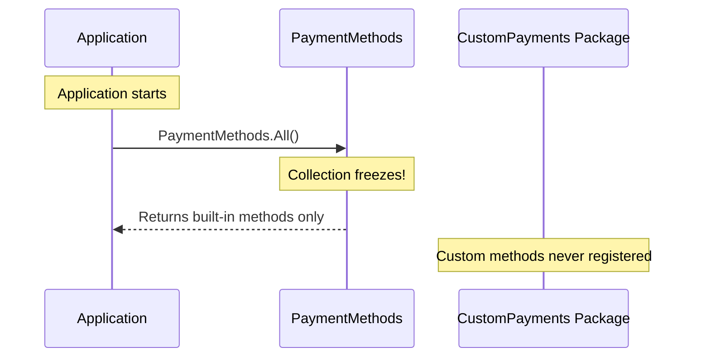

# Collection Declaration

The collection class is a partial class with the `[TypeCollection]` attribute. The source generator fills in the implementation.

## Pattern

From [`PaymentMethods.cs`](../samples/ReferenceSolution/concepts/01-type-collections/src/Reference.TypeCollections/Basic/PaymentMethods.cs):

```csharp
using Fdw.Collections;

namespace Reference.TypeCollections.Basic;

/// <summary>
/// TypeCollection for payment methods.
/// Source generator creates static properties, lookup methods, and FrozenDictionary storage.
/// </summary>
/// <remarks>
/// <para>
/// This is an <b>immutable</b> TypeCollection - all options are discovered at compile time
/// and stored in a FrozenDictionary for O(1) lookups.
/// </para>
/// <para>
/// Generated members include:
/// <list type="bullet">
/// <item>Static properties: PaymentMethods.Cash, PaymentMethods.CreditCard, etc.</item>
/// <item>ById(int id) - O(1) lookup by ID</item>
/// <item>ByName(string name) - O(1) lookup by name</item>
/// <item>All() - Returns all payment methods</item>
/// <item>Empty - Sentinel value for "no payment method"</item>
/// </list>
/// </para>
/// </remarks>
[TypeCollection(typeof(PaymentMethodBase), typeof(IPaymentMethod), typeof(PaymentMethods))]
public abstract partial class PaymentMethods : TypeCollectionBase<PaymentMethodBase, IPaymentMethod>
{
    // Source generator populates this class with:
    // - Static constructor initializing FrozenDictionaries
    // - Static properties for each [TypeOption] payment method
    // - ById(), ByName(), All() methods
    // - Empty sentinel value
}
```

## TypeCollection Attribute

From [`TypeCollectionAttribute.cs:12-28`](../src/Fdw.Collections/Attributes/TypeCollectionAttribute.cs#L12-L28):

```csharp
[TypeCollection(typeof(BaseType), typeof(InterfaceType), typeof(CollectionType))]
```

| Parameter | Description |
|-----------|-------------|
| `BaseType` | The base class for options (e.g., `PaymentMethodBase`) |
| `InterfaceType` | The interface type (e.g., `IPaymentMethod`) |
| `CollectionType` | This collection class (e.g., `PaymentMethods`) |

## Generated Members

The source generator creates the following members (see [`TypeCollectionGenerator.cs`](../src/Fdw.Collections.SourceGenerators/TypeCollectionGenerator.cs)):

```csharp
// Static accessors for each [TypeOption] discovered
public static CashPayment Cash { get; }
public static CreditCardPayment CreditCard { get; }
public static BankTransferPayment BankTransfer { get; }

// Lookup methods
public static IPaymentMethod ByName(string? name);
public static IPaymentMethod ById(int id);
public static IReadOnlyCollection<IPaymentMethod> All();

// Empty sentinel returned when lookups fail
public static IPaymentMethod Empty { get; }

// Registration for cross-assembly discovery
public static void RegisterMember(IPaymentMethod type);
```

## Cross-Assembly Registration

TypeOptions can be defined in separate NuGet packages. The **deferred freeze pattern** ensures they're registered before the collection is accessed.

### The Problem

Static constructors only run when the assembly is accessed. If you call `PaymentMethods.All()` before loading a custom payment method package, those options won't be included.



### The Solution: Module Initializers

The `Registration.SourceGenerators` package generates module initializers in **consuming assemblies**:

```csharp
// Generated in YOUR application
[ModuleInitializer]
internal static void RegisterTypeOptions()
{
    PaymentMethods.RegisterMember(new BitcoinPayment());
}
```

This runs before `Main()`, ensuring all TypeOptions are registered.

### Deferred Freeze Pattern

1. **Before first access**: Options collected via `RegisterMember()`
2. **On first access**: Collection freezes into `FrozenDictionary`
3. **After freeze**: `RegisterMember()` is a no-op (silently ignored)

The generator emits roughly:

```csharp
public static void RegisterMember(IPaymentMethod type)
{
    if (_frozen) return;

    lock (_lock)
    {
        if (_frozen) return;
        if (_pendingRegistrations.Any(p => ReferenceEquals(p, type) || p.GetType() == type.GetType()))
            return;
        _pendingRegistrations.Add(type);
    }
}
```

The collection is frozen on first read; subsequent `RegisterMember` calls are silently ignored (they do **not** throw).

### For Package Authors

To enable transitive registration for consumers, embed the Registration generator:

```xml
<ItemGroup>
  <!-- Embed for transitive flow -->
  <None Include="$(OutputPath)Fdw.Registration.SourceGenerators.dll"
        Pack="true"
        PackagePath="analyzers/dotnet/cs" />
</ItemGroup>
```

Consumers don't need to reference any generator directly - it flows through the dependency chain.

## File Organization

```
Basic/
|-- IPaymentMethod.cs
|-- PaymentMethodBase.cs
|-- PaymentMethods.cs
|-- Options/
    |-- CashPayment.cs
    |-- CreditCardPayment.cs
    |-- BankTransferPayment.cs
```

## Next Steps

- [Generated Lookups](04-05-Generated-Lookups.md) - Using the generated code
