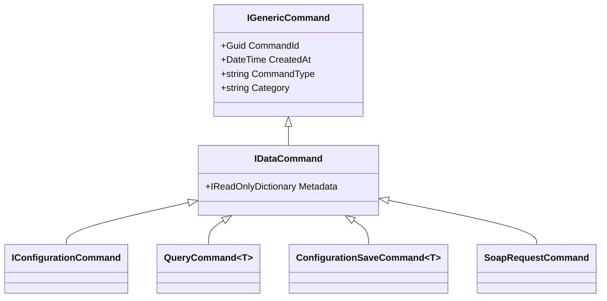

# The Self-Similar Command Pipeline

## The thesis: the name is the architecture

Flexibility and robustness normally pull against each other. Every adapter you bolt on to reach a new
target is a new surface that can rot; every abstraction you add to keep the surface small costs you
reach. FractalDataWorks does not trade between them, because both come from the **same** source: one
mechanism — **TypeCollections plus a uniform command/`Execute` surface** — repeated, self-similarly,
at every layer.

That is what a fractal *is*: a complex object built from one simple part repeated at every scale. It
is also *why* fractals are robust — there is only one part to get right, and getting it right once
fixes it everywhere. **The name FractalDataWorks is the thesis.**

Three consequences you can check in the source:

1. **A Roslyn command and a data connection are virtually the same object.**
   `RoslynWorkspaceConnection` is a `ConnectionBase<IRoslynWorkspaceCommand, …>` registered with
   `[ServiceTypeOption(typeof(ConnectionTypes), "RoslynWorkspace")]` — the *same* base class, the
   *same* registry, the *same* translator seam as `MsSqlConnection`. A Roslyn workspace is not
   "integrated with" the data layer through a bridge; it *is* a connection. (See
   [What ships today](#what-ships-today-vs-what-the-seam-allows) for the honest current state of its
   command surface.)
2. **A command slides into an MCP server, and the same MCP server hosts unrelated commands.**
   `Fdw.Mcp.Bus`'s `IMcpToolSource` knows only a `ServerName` and `Start`/`Stop` against an
   `IMcpEventBus`. The tool behind it is opaque. A Roslyn command and a SQL command reach the bus
   through the same seam because *any* command and *any* service already expose `Execute`.
3. **Breadth is composition, not adapters.** SQL (MsSql/PostgreSql/Sqlite), REST/SOAP/GraphQL/OData,
   the filesystem, JSON/XML/CSV/fixed-width, and Roslyn are all reachable — and there is no
   per-target adapter layer. Each is a different *pick* from the same handful of registries.

The rest of this page is the mechanics.

---

## The pipeline at a glance

```mermaid
flowchart LR
    A["Caller<br/>(endpoint / provider)"] --> B["IDataCommand<br/><i>DataCommands</i>"]
    B --> C["IDataGateway<br/>Execute(cmd, DataStoreTarget)"]
    C --> D["IDataConnection<br/><i>ConnectionTypes</i>"]
    D --> E["IDataCommandTranslator&lt;TCommand&gt;<br/>Translate(cmd, container)"]
    E --> F["TCommand<br/>(SqlCommand / HttpRequestMessage /<br/>IFileSystemCommand)"]
    F --> G["Connection.Execute&lt;T&gt;(TCommand, container)"]
    G --> H["Record source / writer<br/><i>RecordSourceTypes</i>"]
    H --> I["PocoMapperCollection<br/>MapFromReader"]
    I --> J["IGenericResult&lt;T&gt;"]
```



Every box in italics is a TypeCollection. Every arrow is `Execute` or `Translate`. There is no other
kind of edge in the diagram, and there is no per-backend variant of the diagram.

---

## 1. Commands

Commands are inert descriptions of an operation. They carry no connection, no schema, and — since
the addressing split — no address either.

```
IGenericCommand                    (Fdw.Abstractions)  CommandId, CreatedAt, CommandType, Category
   └── IDataCommand                (Fdw.Commands.Data.Abstractions)  + Metadata
         ├── IDataCommand<TResult>
         │     └── IDataCommand<TResult, TInput>   + Data
         └── IConfigurationCommand  (marker; Fdw.Services.Configuration)
```

`DataCommandBase`, `DataCommandBase<TResult>`, and `DataCommandBase<TResult, TInput>` supply the
implementation; `IDataCommandWithInput.InputData` gives translators untyped access to `Data` without
closing a generic.

The verbs are the **`DataCommands`** TypeCollection:

```csharp
[TypeCollection(typeof(DataCommandBase), typeof(IDataCommand), typeof(DataCommands))]
public abstract partial class DataCommands : TypeCollectionBase<DataCommandBase, IDataCommand>
```

| Option | Type | Shape |
|---|---|---|
| `Query` | `QueryCommand<T>` | `DataCommandBase<IEnumerable<T>>`, `IQueryCommand` |
| `Insert` | `InsertCommand<T>` | `DataCommandBase<int, T>` |
| `Update` | `UpdateCommand<T>` | `DataCommandBase<int, T>`, `IFilterableCommand` |
| `Delete` | `DeleteCommand` | `DataCommandBase<int>`, `IFilterableCommand` |
| `BulkInsert` | `BulkInsertCommand<T>` | `DataCommandBase<int, IEnumerable<T>>` |
| `Truncate` | `TruncateCommand` | `DataCommandBase<int>` |
| `Find` | `FindCommand<T>` | `DataCommandBase<IEnumerable<FindResult<T>>>` |
| `ConfigurationSave` | `ConfigurationSaveCommand<T>` | `DataCommandBase<int, T>`, `IConfigurationSaveCommand` |
| `ConfigurationDelete` | `ConfigurationDeleteCommand` | `DataCommandBase<int, Guid>` |
| `SoapRequest` | `SoapRequestCommand` | `DataCommandBase<XElement>` — contributed by **`Fdw.Services.Connections.Http.Abstractions`** |

> **Look at the last row.** A *transport* package adds a verb to the *shared* command collection with
> nothing but a `[TypeOption(typeof(DataCommands), "SoapRequest")]` attribute. There is no
> "HTTP command registry" for it to live in instead. That is the self-similarity paying rent.

---

## 2. Command consistency: one shape, three parameterizations

The most common misreading of FDW is that "configuration commands" are a special subsystem. They are
not. A configuration command, a plain data command, and a domain's (e.g. SecretManager's) command are
**the same shape**, differing only in what they parameterize.



`IConfigurationCommand : IDataCommand` — that is the whole of it. There is no parallel hierarchy, no
second gateway, no second translator interface.

### `ConfigurationCommands` — a parameterized data command, shared by every domain

`ConfigurationCommandBase<TConfig>` is not a new command type. It is a **factory of ordinary data
commands**, specialized for the configuration table shape (version-on-write + `IsCurrent` / `IsDeleted`
+ typed-body FK joins). Each verb *builds a `QueryCommand<TConfig>` / `ConfigurationSaveCommand<TConfig>` /
`ConfigurationDeleteCommand`* and hands it back:

```csharp
public abstract class ConfigurationCommandBase<TConfig> : IConfigurationCommands
    where TConfig : class, IGenericConfiguration
{
    public string TableName { get; }
    public string ContainerName => TableName;
    public Type ConfigType => typeof(TConfig);
    protected virtual string NameColumn => "Name";

    public virtual IDataCommand Create(string dataStoreName, string pathName, TConfig record)
        => new ConfigurationSaveCommand<TConfig>(record);

    public virtual IDataCommand Get(string dataStoreName, string pathName, string name)
        => new QueryCommandBuilder<TConfig>(dataStoreName, pathName, TableName)
            .Where(NameColumn, name)
            .Where("IsCurrent", true)
            .Where("IsDeleted", false)
            .Build().Command;

    public virtual IDataCommand Delete(string dataStoreName, string pathName, Guid id)
        => new ConfigurationDeleteCommand(id);
    // … Get(id), List, Update, ViewHistory, Validate, CacheTag(pathName)
}
```

Plus three parent-aware reads used by the typed-body (polymorphic header + body) pattern —
`GetByParent` (join on the parent's **logical** `Id`), `GetByPhysicalParent` (join on the parent's
**physical** `RowId`), and `GetByParentJoin` (JOIN child→parent on the FK, filter on the parent's
durable `Id`). The join column names are always **passed in by the provider from container metadata** —
the verb never guesses a key. (This is the no-fallbacks rule as a method signature.)

Registering a domain's commands is one attribute on an empty class:

```csharp
[TypeOption(typeof(ConfigurationCommands), "SecretManager")]
public sealed class SecretManagerConfigurationCommand
    : ConfigurationCommandBase<SecretManagerConfiguration>
{
    public SecretManagerConfigurationCommand() : base("SecretManager") { }
}

[TypeOption(typeof(ConfigurationCommands), "EnvironmentVariableSecretManager")]
public sealed class EnvironmentVariableConfigurationCommand
    : ConfigurationCommandBase<EnvironmentVariableConfiguration>
{
    public EnvironmentVariableConfigurationCommand() : base("EnvironmentVariableSecretManager") { }
}
```

**83 such options are registered across 36 packages** — Connections, SecretManagers, Scheduling, Etl,
Quality, Authorization, Users, Themes, Calculations, Notifications, … Every one of them is those four
lines. None of them writes a query, a translator, or a mapper.

The `ConfigurationCommands` collection is keyed on the interface, so the save cascade resolves a
child's command **by `ConfigType`** rather than by name:

```csharp
ConfigurationCommands.All().FirstOrDefault(c => c.ConfigType == childType)
```

(`ByName`/`ById` are generated stubs for interface-keyed collections — see
[TypeCollection Patterns](10-TypeCollection-Patterns.md).)

---

## 3. Translators — the adapter *is* the translator

There is no "adapter layer" in FDW. The thing other frameworks call an adapter is exactly one
interface here, and it is a TypeOption:

```csharp
public interface IDataCommandTranslator<TCommand> : ITypeOption<int>
{
    string DomainName { get; }   // "Sql", "Rest", "File", …

    Task<IGenericResult<TCommand>> Translate(
        IDataCommand command,
        IStorageContainer container,          // schema + physical address + format
        CancellationToken cancellationToken = default);
}
```

`IDataCommand` in, native command out, container as the only context. Three families implement it:

| Family | Translator | `TCommand` |
|---|---|---|
| SQL | `SqlDataCommandTranslatorBase<TCommand>` → `MsSqlDataCommandTranslatorBase` / `PostgreSqlDataCommandTranslatorBase` / `SqliteDataCommandTranslatorBase` | `SqlCommand` / `NpgsqlCommand` / `SqliteCommand` |
| HTTP | `HttpProtocolTranslatorAdapter` (wraps an `IHttpProtocol`) | `HttpRequestMessage` |
| File | `FileSystemCommandTranslator` (`DomainName = "File"`) | `IFileSystemCommand` |

### The SQL family shares one translator body

`SqlDataCommandTranslatorBase<TCommand>` implements WHERE-building, ORDER BY, paging, column-name
validation, and parameterization **once**, parameterized by an `ISqlDialect` that is read from the
container's `IDatabasePath` at translate-time:

```csharp
public interface ISqlDialect
{
    string Name { get; }                       // "TSql", "PlPgSql", "Sqlite"
    bool SupportsSchemaNamespace { get; }
    string QuoteIdentifier(string identifier); // [x] vs "x"
    // + parameter prefix, paging syntax, always-false predicate
}
```

> **No fallbacks.** If the container's path is not an `IDatabasePath`, the translator fails loud. The
> dialect is *always* derived from the path — never defaulted. Adding PostgreSQL did not add a SQL
> builder; it added a dialect.

### The HTTP family shares one translator, parameterized by protocol

`HttpProtocolTranslatorAdapter : IDataCommandTranslator<HttpRequestMessage>` holds an `IHttpProtocol`
and a context, and delegates. The protocol is itself a TypeOption in the `HttpProtocols` collection:
**Rest, Soap11, Soap12, GraphQL, GraphQLSubscriptions, JsonApi, OData, ApolloFederation**. REST vs
SOAP vs GraphQL is a *pick*, not a package.

---

## 4. Connections — backend-anonymous by construction

```csharp
public abstract class ConnectionBase<TCommand, TConfiguration, TService>
    : ServiceBase<IDataCommand, TConfiguration, TService>, IDataConnection
{
    protected abstract IDataCommandTranslator<TCommand> GetTranslator(string commandType);

    public async Task<IGenericResult<T>> Execute<T>(
        IDataCommand command, IDataContainer container, CancellationToken ct)
    {
        var translator = GetTranslator(command.CommandType);
        // translate → Execute<T>(TCommand, container, ct) → materialize
    }

    protected abstract Task<IGenericResult<T>> Execute<T>(
        TCommand command, IStorageContainer container, CancellationToken cancellationToken);
}
```

The public surface is `IDataConnection` — three `Execute` overloads (typed, untyped, and a
`Type elementType` overload for rows whose CLR type is only known at runtime, so the config cascade
never needs `MakeGenericMethod`). **There is no `IMsSqlConnection` in the abstraction.** Nothing above
the connection layer can name a backend; the backend appears exactly once, as a `[ServiceTypeOption]`
name:

```csharp
[ServiceTypeOption(typeof(ConnectionTypes), "FileSystem")]
public sealed class FileSystemConnectionType
    : ConnectionTypeBase<IGenericConnection, IFileSystemConnectionFactory, FileSystemConnectionConfiguration>
```

`ConnectionTypes` is an ordinary `[ServiceTypeCollection]` (`ServiceCategory = "Connection"`,
`GenerateProvider = true`) whose current options are:

| Option | Package | Native command |
|---|---|---|
| `MsSql` | `Fdw.Services.Connections.MsSql` | `SqlCommand` |
| `PostgreSql` | `Fdw.Services.Connections.PostgreSql` | `NpgsqlCommand` |
| `Sqlite` | `Fdw.Services.Connections.Sqlite` | `SqliteCommand` |
| `Http` | `Fdw.Services.Connections.Http` | `HttpRequestMessage` |
| `FileSystem` | `Fdw.Services.Connections.FileSystem` | `IFileSystemCommand` |
| `RoslynWorkspace` | `Fdw.Services.Connections.RoslynWorkspace` | `IRoslynWorkspaceCommand` |

---

## 5. Connectors — the record-source/writer runners

A **connector** is the small internal runner that drives the format factory over a transport's raw
byte/stream surface. It is *not* an abstraction layer:

```csharp
internal sealed class FileSystemRecordConnector   // Fdw.Services.Connections.FileSystem
{
    // Read:  RecordSourceTypes.ByName(container.Format.Name).Create(context) → rows
    // Write: RecordWriterTypes.ByName(container.Format.Name).Create(context) → text → file
}

internal sealed class HttpRecordConnector          // Fdw.Services.Connections.Http
{
    // Write: RecordWriterTypes.ByName(container.Format.Name).Create(context) → body → POST/PUT
}
```

Both are `internal`, both name **zero** concrete readers or writers, and both take the container's
configured fields as the schema — there is no per-format container class and no compile-time DTO.
Adding a format adds a `RecordSourceType`, not a branch.

The *streaming* counterpart is a capability interface on the connection, not a separate object:

```csharp
public interface IRecordSourceConnection
{
    Task<IGenericResult<IRecordSource<DataRecord>>> OpenRecordSource(
        IDataCommand command, IDataContainer container, CancellationToken cancellationToken = default);
}
```

It is a *separate* interface only because the abstractions target `netstandard2.0`, which has no
default interface methods — putting it on `IDataConnection` would force every connection to implement
it. `IDataGateway.OpenRecordSource` feature-detects it.

> ### `IDataConnector` does not exist — and must not
>
> Grep the tree: there is no `IDataConnector`, and none should ever be added. A "data connector"
> interface would be `IDataConnection` under a second name: same `Execute`, same command, same
> container, same result. Two names for one seam is precisely the rot the fractal thesis exists to
> prevent. The word *connector* in FDW means only the record-source/writer runner described above —
> a class, never a public abstraction.

---

## What ships today vs. what the seam allows

Documentation earns trust by being exact about the gap between the mechanism and its current wiring.

| | Status |
|---|---|
| `MsSql` / `PostgreSql` / `Sqlite` / `Http` / `FileSystem` connections | Full `IDataCommand` → translator → `Execute` path, live |
| `RoslynWorkspace` connection | Registered in `ConnectionTypes`, derives `ConnectionBase`, **but** ships no concrete `IRoslynWorkspaceCommand` types yet: `GetTranslator` returns a null sentinel and the DataGateway path fails loud. Consumers use `IRoslynWorkspaceClient` directly. |
| Roslyn *commands* | Live, but through their own sibling stack: `RoslynCommandBase : TypeOptionBase<int, RoslynCommandBase>` in the `RoslynCommands` collection, `IRoslynCommandTranslator : IDevelopmentCommandTranslator`, executed by `RoslynCommandHandler.Execute<TCommand, TResult>` over a `TranslatorRegistry`. |

Read that last row again: the Roslyn stack is **the same three parts** — a command TypeCollection, a
translator keyed by command type, and an `Execute` that returns `IGenericResult<T>`. The remaining
work to make a Roslyn command interchangeable with a data command is to declare
`IRoslynWorkspaceCommand` types and a translator — *not* to build a bridge. There is no bridge to
build, and that is the point.

---

## Related

- [DataGateway Pattern](05-01-DataGateway-Pattern.md) — the routing layer above the connection
- [Formats and Physical Addressing](05-05-Formats-And-Physical-Addressing.md) — how a container names its bytes
- [A Config Source Is Just a Connection](05-06-Configuration-Source-Is-A-Connection.md) — the worked proof
- [DataNode Core Split](05-03-DataNode-Core-Split.md) — the `IDataStore` tree the container comes from
- [TypeCollections Overview](04-01-Overview.md) — the one mechanism, described on its own terms
- [Connections Service Domain](06-03-Connections-Service-Domain.md) — registration and per-backend detail
