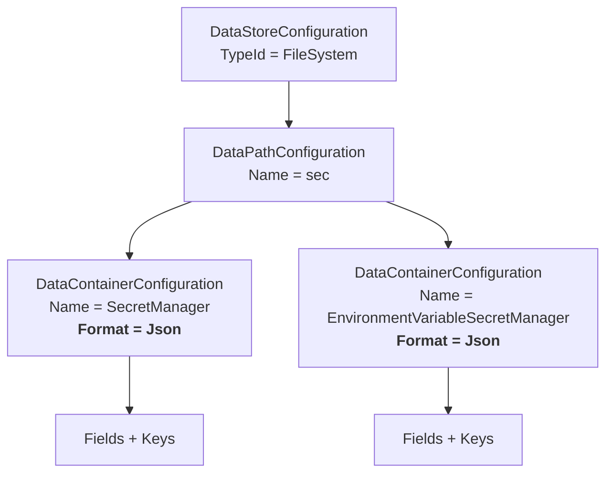
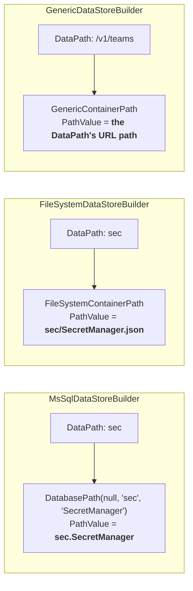
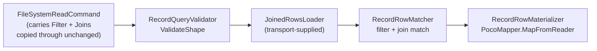

# Formats and Physical Addressing

> **The central lesson of this page:** **JSON, XML, CSV, and Parquet are FORMATS — flavors of an
> existing connection — NOT connection types.** Reading configuration from a JSON folder is the
> **FileSystem connection with `Format = "Json"`**. It is not a "Json connection", and building one
> would have been a whole package of dead weight duplicating a `RecordSourceType` that already
> existed.
>
> Before you add *anything* to the connection layer, ask which of the six axes you are actually
> varying (transport, protocol, translator, connector, **format**, mapper). Almost always the answer
> is one axis, and that axis is already a registry.

---

## Where format lives

Format is a property of a **container**, not of a connection:



`DataContainerConfiguration.Format` is a `string?`. `ContainerComposition.ResolveFormat` turns it
into an `IFormatType`:

```csharp
internal static IFormatType ResolveFormat(DataContainerConfiguration cfg, IFormatType defaultResponseFormat)
{
    // Why: an explicit, INVALID Format discriminator resolves to NotFound (observable as a failed
    // read), not a guessed substitute — the no-fallback rule.
    if (!string.IsNullOrWhiteSpace(cfg.Format))
        return FormatTypes.ByName(cfg.Format);

    // Why: an unset Format inherits the TRANSPORT's declared default (IConnectionType.DefaultResponseFormat,
    // supplied by the transport's SupplyBuilder). A missing default arrives here as FormatTypes.NotFound
    // and fails loud downstream — never a silent substitute.
    return defaultResponseFormat;
}
```

Note what is absent: no `switch (format)`, no per-format container subclass, and no default string.

---

## Three format registries, one seam each

| Collection | Package | Options | Seam |
|---|---|---|---|
| `FormatTypes` | `Fdw.Data.Abstractions` | `Tabular`, `Json`, `Xml`, `Csv` | metadata: MIME type, binary?, streaming?, **canonical file extension** |
| `RecordSourceTypes` | `Fdw.Data.RowSources` | `DataReader`, `Json`, `Xml`, `Delimited`, `FixedWidth`, `Http` | `RecordSourceTypes.ByName(format).Create(RecordSourceContext) → IRecordSource<DataRecord>` |
| `RecordWriterTypes` | `Fdw.Data.RowSources` | `Json`, `Xml`, `Delimited`, `FixedWidth` | `RecordWriterTypes.ByName(format).Create(RecordWriterContext) → IRecordWriter<DataRecord>` |

Record sources/writers are adapters over an existing stream or `TextWriter`, so they are plain
TypeCollection members — **no DI**. That is why a connector can resolve one by name at the moment it
needs it, with no registration ceremony:

```csharp
// FileSystemRecordConnector.Read — the whole format dispatch
var context = new RecordSourceContext(stream, Fields(container), ContainerRecordOptions.BuildSourceOptions(container));
using var source = RecordSourceTypes.ByName(container.Format.Name).Create(context);
foreach (var recordResult in source.Read()) { … }
```

**Adding Parquet** means adding a `ParquetFormatType` (a `FormatTypes` option) and a
`ParquetRowSourceType` (a `RecordSourceTypes` option). It does not touch the connection, the
translator, the gateway, the provider, the command, or the mapper.

---

## `IFormatType.CanonicalFileExtension` (new)

A format that can be addressed as a *file* must say what a file of it is called. This is **not**
derivable from the format name (a `Delimited` record source is also `.csv`), so it is declared,
explicitly, per option — with **no default**:

```csharp
public interface IFormatType : ITypeOption<int>
{
    string MimeType { get; }
    bool IsBinary { get; }
    bool SupportsStreaming { get; }

    /// Canonical file extension (with the leading dot) used when a container of this format is
    /// addressed as a FILE. Empty string ⇒ NOT file-addressable.
    string CanonicalFileExtension { get; }
}
```

`FormatTypeBase`'s constructor takes it as a required argument, exactly as it takes `mimeType` — a
format option cannot forget to answer the question.

| Format option | Id | `CanonicalFileExtension` | File-addressable? |
|---|---|---|---|
| `Tabular` | 1 | `""` | **No** — SQL result sets are not files |
| `Json` | 2 | `.json` | Yes |
| `Xml` | 3 | `.xml` | Yes |
| `Csv` | 4 | `.csv` | Yes |

**Empty ⇒ fail loud.** `FileSystemDataStoreBuilder.ValidateConfiguration` rejects the store *before
any node is built* if a container's resolved format has no canonical extension (or resolved to the
`NotFound` sentinel):

```csharp
protected override IGenericResult ValidateConfiguration(DataStoreConfiguration config)
{
    foreach (var pathCfg in config.Paths)
    foreach (var containerCfg in pathCfg.Containers)
    {
        var format = ContainerComposition.ResolveFormat(containerCfg, _defaultResponseFormat);
        if (ReferenceEquals(format, FormatTypes.NotFound) || string.IsNullOrEmpty(format.CanonicalFileExtension))
            return GenericResult.Failure(
                DataStoreLoaderLog.FormatNotFileAddressable(Logger, containerCfg.Name, format.Name));
    }
    return GenericResult.Success();
}
```

A `Tabular` container in a FileSystem store is a configuration error, and it is reported as one — not
silently written to an extension-less path.

---

## Addressing: a container's `Path` IS its physical address, leaf included

Every container node carries an `IPath` whose `PathValue` is the **complete** physical address of the
object — not the folder or schema that contains it. This is the invariant that makes one translator
work for every transport: the translator never composes an address, it *reads* one.

Each transport's `IDataStoreBuilder` composes it:



| Transport | `IPath` implementation | `Domain` | `PathValue` |
|---|---|---|---|
| MsSql / SQL family | `DatabasePath` | (structured) | `{schema}.{object}` (or `{db}.{schema}.{object}`) |
| FileSystem | `FileSystemContainerPath` | `"File"` | `{folder}/{container}{format.CanonicalFileExtension}` |
| Http | `GenericContainerPath` | `"Generic"` | the DataPath's URL path |

```csharp
// FileSystemDataStoreBuilder.BuildContainer
new FileSystemContainerPath($"{parent.Name}/{containerCfg.Name}{format.CanonicalFileExtension}")

// MsSqlDataStoreBuilder.BuildContainer
new DatabasePath(null, parent.Name, containerCfg.Name)
```

### Why the leaf matters (the bug this fixed)

Before `FileSystemDataStoreBuilder` existed, the FileSystem transport used the shared
`GenericDataStoreBuilder`, which addresses a container by its **owning DataPath's name alone**. That is
correct for HTTP — the DataPath *is* the URL path — but for files it collapses every container under
one path onto **one file**. A configuration header (`sec/SecretManager`) and its typed body
(`sec/EnvironmentVariableSecretManager`) both resolved to `sec`, and the read was unrecoverable.

The fix is the system-level one: give the file transport its own builder that composes a real leaf
address, exactly as MsSql already composed `{schema}.{object}`. No call site was special-cased.

### Sibling navigation (the second fix)

A typed-body JOIN needs `container.Parent.Container(siblingName)` to resolve. `DataStoreBuilderBase`
now builds the final `DataPath` **first** and parents every container to *that* object, wiring the
index once via `DataPath.SetContainers`:

```csharp
var path = new DataPath(pathCfg.Name, store: null!, [], pathCfg.Description, _logger);
// … build every container with `path` as Parent …
path.SetContainers(finalContainers);   // set-once; a second call is a wiring defect → throws
```

Previously containers were parented to a throwaway *placeholder* path, so sibling lookup always
missed. The fix lives in the shared base and therefore fixes **every** transport at once — the
canonical shape of a system-level fix.

---

## Mapping: rows → POCOs, once, for everything

The last hop is the same regardless of where the bytes came from. `PocoMapperCollection` is a
TypeCollection of **source-generated** mappers keyed by type name:

```csharp
var mapper = PocoMapperCollection.ByName(itemType.Name);
if (mapper == PocoMapperCollection.NotFound)
    return GenericResult<T>.Failure(RecordQueryLog.NoMapperFound(logger, itemType.Name));

using var reader = new RecordDictionaryReader(rows);   // DbDataReader over in-memory dictionaries
while (reader.Read())
{
    var mapResult = mapper.MapFromReader(reader, container);
    if (!mapResult.IsSuccess)
        return GenericResult<T>.Failure(RecordQueryLog.MaterializationFailed(logger, itemType.Name, mapResult.CurrentMessage));
    list.Add(mapResult.Value);
}
```

`IPocoMapper` exposes two entry points, and **choosing between them is a correctness decision, not a
style one**:

| Method | Behavior | Use when |
|---|---|---|
| `MapFromReader(DbDataReader, IStorageContainer)` | **Coerces** — parses strings into `Guid` / `DateTimeOffset` / numerics, honours container schema | Always, for rows decoded from a format |
| `MapFromDictionary(IDictionary<string, object?>)` | **Hard-casts** — throws on a mismatch | Only where values are already CLR-typed (e.g. calculated-field execution) |

`RecordDictionaryReader` exists precisely to let file/HTTP rows use the *coercing* path: a JSON decode
yields only `string` / `long` / `double` / `bool` / `null`, so a POCO column typed `Guid` arrives as a
string and **must be parsed, not cast**. Wrapping the decoded rows as a `DbDataReader` means the same
generated mapper that materializes a `SqlDataReader` row materializes a JSON row — no second mapping
code path exists.

---

## The shared row-query pipeline (`Fdw.Services.Connections/RowQuery`)

A SQL backend pushes `WHERE` and `JOIN` down to the engine. A file has no engine, so the FileSystem
connection evaluates them over the decoded rows — but it does so through a **shared, transport-agnostic**
component, not a private one:



| Type | Role |
|---|---|
| `RecordQueryEvaluator.Evaluate(rows, filter, joins, loadJoinedRows, logger, ct)` | Orchestrates validate → load join target → match |
| `RecordQueryValidator.ValidateShape` | Fails loud on an unsupported filter/join shape — never a silent partial match |
| `RecordRowMatcher` | Applies the filter and the single supported INNER join |
| `RecordRowMaterializer.Materialize<T>` | Rows → `T` via `PocoMapperCollection` |
| `JoinedRowsLoader` (delegate) | The **only** transport-specific part: "given a sibling container name, get me its rows" |

The connection supplies the loader (it resolves the sibling via `container.Parent.Container(name)` and
reads it through the same record connector). Everything else is shared, and any future
record-source transport gets filter/join for free.

> **The failure this prevents:** the earlier FileSystem translator dropped `Filter` entirely and read
> the whole file. A whole-file read that *pretends* to be a filtered one is worse than an error. The
> translator now copies `Filter`/`Joins` onto the native command unchanged, and the connection applies
> them — or fails loud.

---

## Related

- [The Self-Similar Command Pipeline](05-04-Self-Similar-Command-Pipeline.md) — commands, translators, connections, connectors
- [A Config Source Is Just a Connection](05-06-Configuration-Source-Is-A-Connection.md) — all of this, proven end to end
- [DataNode Core Split](05-03-DataNode-Core-Split.md) — where `DataStoreBuilderBase` and the node types live
- [JSON-Driven Configuration](03-05-JSON-Driven-Configuration.md) — the `configurationSchema.json` that declares containers and formats
- [Schema Abstractions](08-01-Schema-Abstractions.md) — the container/field/key model
