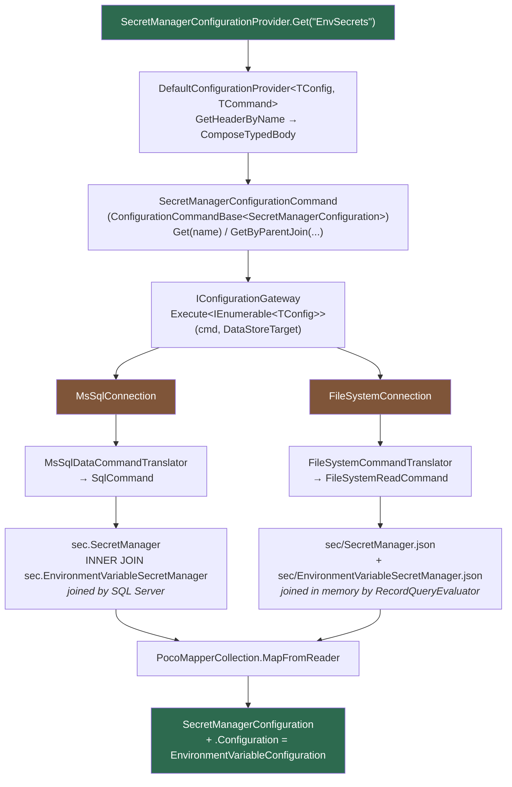
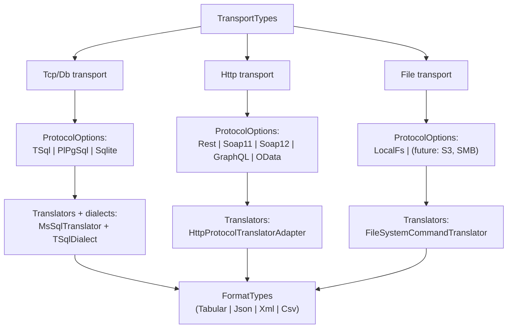

# A Config Source Is Just a Connection

A configuration source is **a connection behind the unchanged `ConfigurationGateway`** — never a
bespoke second gateway, never a parallel provider, never a "file configuration subsystem".

This page is the proof. The **same** `SecretManagerConfigurationProvider.Get("EnvSecrets")` call runs,
**unchanged**, against SQL Server and against a folder of JSON files. Gateway, provider, command, and
mapper are identical in both runs. Only the *connection* differs.

---

## The two runs



Everything green is identical. Everything brown is the *only* difference. Note what is **not** in the
diagram: no file-specific provider, no JSON command, no second gateway, no `if (isFile)`.

---

## What changes, and what does not

| Layer | MsSql run | JSON-folder run |
|---|---|---|
| Caller | `provider.Get("EnvSecrets")` | **identical** |
| Provider | `SecretManagerConfigurationProvider : DefaultConfigurationProvider<SecretManagerConfiguration, SecretManagerConfigurationCommand>` | **identical** |
| Command | `ConfigurationCommandBase.Get(name)` → `QueryCommand<SecretManagerConfiguration>` | **identical** |
| Typed-body read | `ConfigurationCommandBase.GetByParentJoin(...)` → `QueryCommand` + `Join` | **identical** |
| Gateway | `IConfigurationGateway.Execute<IEnumerable<T>>(cmd, DataStoreTarget)` | **identical** |
| Mapper | `PocoMapperCollection.ByName("SecretManagerConfiguration").MapFromReader` | **identical** |
| **Connection** | `MsSqlConnection` | **`FileSystemConnection`** |
| **Translator** | `MsSqlDataCommandTranslatorBase` → `SqlCommand` | **`FileSystemCommandTranslator` → `FileSystemReadCommand`** |
| **Join execution** | pushed down: `INNER JOIN` in T-SQL | in memory: `RecordQueryEvaluator` + `JoinedRowsLoader` |
| **Physical address** | `sec.SecretManager` (`DatabasePath`) | `sec/SecretManager.json` (`FileSystemContainerPath`) |

The connection is swapped by **one type argument** at startup:

```csharp
// A database-backed host
services.AddConfigurationGateway<MsSqlConnectionFactory, EnvironmentVariableSecretManager>("configurationSchema.json");

// A database-LESS host — same gateway, same providers, same commands
services.AddConfigurationGateway<FileSystemConnectionFactory>("configurationSchema.json");
```

---

## The schema that makes it work

The FileSystem run's `configurationSchema.json` declares one connection whose
`ServiceOptionType` is `FileSystem` and whose `Configuration.Root` is a folder — then declares the
DataStore shape exactly as a SQL host would, with `Format: "Json"` on each container:

```jsonc
{
  "ConfigurationSchema": {
    "Connections": [
      { "Name": "ConfigurationDb", "ServiceOptionType": "FileSystem",
        "Configuration": { "Root": "config-data" } }
    ],
    "SecretManagers": [
      { "Name": "EnvSecrets", "ServiceOptionType": "EnvironmentVariable",
        "Configuration": { "Prefix": "FDW_SECRET_" } }
    ],
    "DataStores": [
      {
        "Name": "ConfigurationDb",
        "TypeId": "FileSystem",
        "Paths": [
          {
            "Name": "sec", "Path": "sec", "PathType": "DatabasePath",
            "Containers": [
              {
                "Name": "SecretManager", "TypeId": "Table", "Format": "Json",
                "Fields": [ /* RowId, Id, Name, ServiceOptionType, IsCurrent, IsDeleted */ ],
                "Keys": [
                  { "Name": "PK_SecretManager",         "TypeId": "Physical", "KeyFields": [ { "Name": "RowId" } ] },
                  { "Name": "PK_SecretManager_Logical", "TypeId": "Logical",  "KeyFields": [ { "Name": "Id" } ] }
                ]
              },
              {
                "Name": "EnvironmentVariableSecretManager", "TypeId": "Table", "Format": "Json",
                "Fields": [ /* RowId, Id, SecretManagerId, SecretManagerRowId, Prefix, … */ ],
                "Keys": [
                  { "Name": "PK_EnvironmentVariableSecretManager", "TypeId": "Physical", "KeyFields": [ { "Name": "RowId" } ] },
                  { "Name": "FK_EnvironmentVariableSecretManager_SecretManager",
                    "TypeId": "Foreign",
                    "KeyFields": [ { "Name": "SecretManagerRowId" } ],
                    "ReferencedContainerName": "SecretManager",
                    "ReferencedKeyName": "PK_SecretManager" }
                ]
              }
            ]
          }
        ]
      }
    ]
  }
}
```

The **container name + format extension** give the file address
(`sec/SecretManager.json`, `sec/EnvironmentVariableSecretManager.json` — see
[Formats and Physical Addressing](05-05-Formats-And-Physical-Addressing.md)); the **declared FK** is
what the typed-body JOIN rides. The data files are plain JSON arrays of row objects:

```jsonc
// config-data/sec/SecretManager.json
[ { "RowId": 1, "Id": "1111…", "Name": "EnvSecrets",
    "ServiceOptionType": "EnvironmentVariable", "IsCurrent": true, "IsDeleted": false } ]

// config-data/sec/EnvironmentVariableSecretManager.json
[ { "RowId": 1, "Id": "2222…", "SecretManagerId": "1111…", "SecretManagerRowId": 1,
    "Prefix": "FDW_SECRET_", "IsEnabled": true, "IsCurrent": true, "IsDeleted": false } ]
```

Same columns as the SQL tables — including `RowId`/`Id` (physical vs logical key) and the
version-on-write `IsCurrent`/`IsDeleted` flags — because the *command* is the same command and it
filters on them.

---

## The working proof

`public/tests/Fdw.Services.Connections.FileSystem.Tests/Integration/FileSystemConnectionGatewayTests.cs`

```csharp
[Fact]
[Trait("Category", "Integration")]
public async Task GetByNameComposesTheHeaderAndTypedBodyThroughTheFileSystemConnection()
{
    var secretManagerProvider = _fixture.Provider.GetRequiredService<SecretManagerConfigurationProvider>();

    var result = await secretManagerProvider.Get("EnvSecrets", TestContext.Current.CancellationToken);

    result.IsSuccess.ShouldBeTrue(result.CurrentMessage?.ToString());
    result.Value!.Name.ShouldBe("EnvSecrets");
    result.Value!.Configuration.ShouldBeOfType<EnvironmentVariableConfiguration>();
    ((EnvironmentVariableConfiguration)result.Value!.Configuration!).Prefix.ShouldBe("FDW_SECRET_");
}
```

A sibling test, `GetByIdComposesTheSameAggregateAsGetByName`, drives the `Get(Guid)` overload — which
takes the **`GetByParentJoin`** path — and asserts the same composed aggregate.

The fixture (`FileSystemConnectionGatewayFixture`) is a real host in miniature:

```csharp
var services = new ServiceCollection();
services.AddLogging();
services.AddConfigurationGateway<FileSystemConnectionFactory>("configurationSchema.json");
services.AddSingleton(sp => new Lazy<IConfigurationGateway>(() => sp.GetRequiredService<IConfigurationGateway>()));
SecretManagerTypes.Register(services, null);

Provider = services.BuildServiceProvider();
SecretManagerTypes.Initialize(Provider, null);
Provider.GetRequiredService<IFdwServiceProvider<ISecretManager, SecretManagerConfiguration>>();
```

No FileSystem-specific configuration provider. No JSON-specific registration. The only FileSystem
token in the entire wiring is the `FileSystemConnectionFactory` type argument.

### What this cost

Two fixes, both **in shared code**, both benefiting every transport:

1. `FileSystemDataStoreBuilder` + `FileSystemContainerPath` — a container's physical `Path` is the
   full file path, leaf included (previously the header and its typed body collapsed onto one file).
2. `DataStoreBuilderBase` now parents containers to the **final** `DataPath` and wires the index with
   `DataPath.SetContainers`, so `container.Parent.Container(sibling)` — *every* typed-body JOIN, on
   *every* transport — resolves. It had always missed.

Plus one new declared property (`IFormatType.CanonicalFileExtension`) and one shared component
(`RowQuery` — filter/join evaluation over decoded rows). **Zero** new connection types, **zero** new
gateways, **zero** new providers, **zero** new commands.

---

## The wrong turn this replaced

The first attempt at this feature built a **Json connection**: a new `ConnectionTypes` option, a new
factory, a new configuration POCO, a new translator — an entire package. It was deleted.

JSON is not a way of *connecting* to anything. It is a way of *encoding* records. The thing that
connects is the filesystem, and it already existed; JSON's decoder already existed too, as a
`RecordSourceTypes` option. The correct change was to make the FileSystem connection address its
containers as files and let the existing format registry do the rest.

> **The triage rule:** before adding a type or a package, verify that an existing option, format, or
> collection does not already cover it. Bespoke is the **last** resort. The tells here were loud —
> there is no `IMsSqlConnection`, formats are already a registry (`RecordSourceTypes`), and everything
> already rides `Execute`.

---

## Future Enhancement — **DESIGNED, NOT BUILT**

> ⚠️ **Nothing in this section exists in the source tree.** `ConnectionBuilder`, `TransportTypes`, and
> `IRecordConnector` are **not** types you can reference today — they are the designed next step,
> recorded here so the direction is not re-derived (or accidentally re-invented as something else).

### Composed Connection

Retire the per-backend connection classes and factories. **`IDataConnection` stays UNCHANGED** — it
just consumes the output of a generic `ConnectionBuilder.Build()` instead of one of six distinct
factories. Nothing above the connection layer notices, because nothing above the connection layer can
name a backend today either.

The axes already exist as separate registries; a connection is a *point* in their product:

| Axis | Today's registry |
|---|---|
| transport | `ConnectionTypes` (`MsSql`, `Http`, `FileSystem`, …) |
| protocol | `HttpProtocols` (`Rest`, `Soap11`, `GraphQL`, `OData`, …) |
| translator / dialect | `IDataCommandTranslator<T>` + `ISqlDialect` |
| connector | `FileSystemRecordConnector` / `HttpRecordConnector` |
| format | `FormatTypes` / `RecordSourceTypes` / `RecordWriterTypes` |
| mapper | `PocoMapperCollection` |

### Validity by construction — nested (Service)TypeCollections

Not every point in that product is meaningful (`FileSystem` × `GraphQL` is nonsense). Rather than
validating combinations at runtime, make invalid ones **unrepresentable**, by nesting the collections
so each level's options are declared *by* the level above:



`ConnectionBuilder` walks that tree; an invalid pick has no option to name, and a pick that resolves
to a `NotFound` sentinel **fails loud** (the existing TypeCollection contract — see
[TypeCollection Patterns](10-TypeCollection-Patterns.md)). Validity becomes a property of the type
system, not of a validator someone has to remember to call.

### Auto-migration tool

Existing `conn.MsSqlConnection` / `conn.PostgreSqlConnection` typed-body rows map mechanically onto
their composed form (transport = Db, protocol = TSql/PlPgSql, format = Tabular, …). A one-shot
migration tool writes the composed rows so no hand-editing of live configuration is required.

### `DbRecordConnector` + a shared `IRecordConnector`

The genuine future use of the word *connector*. SQL Server 2025's `FOR JSON` / `FOR XML` return a
**document**, not a rowset — which is exactly what the record-source seam already consumes. A
`DbRecordConnector`, sharing an `IRecordConnector` abstraction with `FileSystemRecordConnector` and
`HttpRecordConnector`, would push those results through the same `RecordSourceTypes` decode path:
`Json` over a SQL stream would then be the *same* code as `Json` over a file stream.

That — one decoder, three transports, no new abstraction — is the fractal argument in its most
compact form.

---

## Related

- [The Self-Similar Command Pipeline](05-04-Self-Similar-Command-Pipeline.md) — the thesis and the mechanics
- [Formats and Physical Addressing](05-05-Formats-And-Physical-Addressing.md) — `Format`, `CanonicalFileExtension`, container `Path`
- [JSON-Driven Configuration](03-05-JSON-Driven-Configuration.md) — `configurationSchema.json` in a normal (SQL) host
- [Polymorphic Configuration Pattern](03-07-Polymorphic-Configuration-Pattern.md) — the header + typed-body shape being read here
- [Connections Service Domain](06-03-Connections-Service-Domain.md) — `ConnectionTypes` registration
- [Secret Management](12-10-Secret-Management.md) — the SecretManager domain used as the worked example
