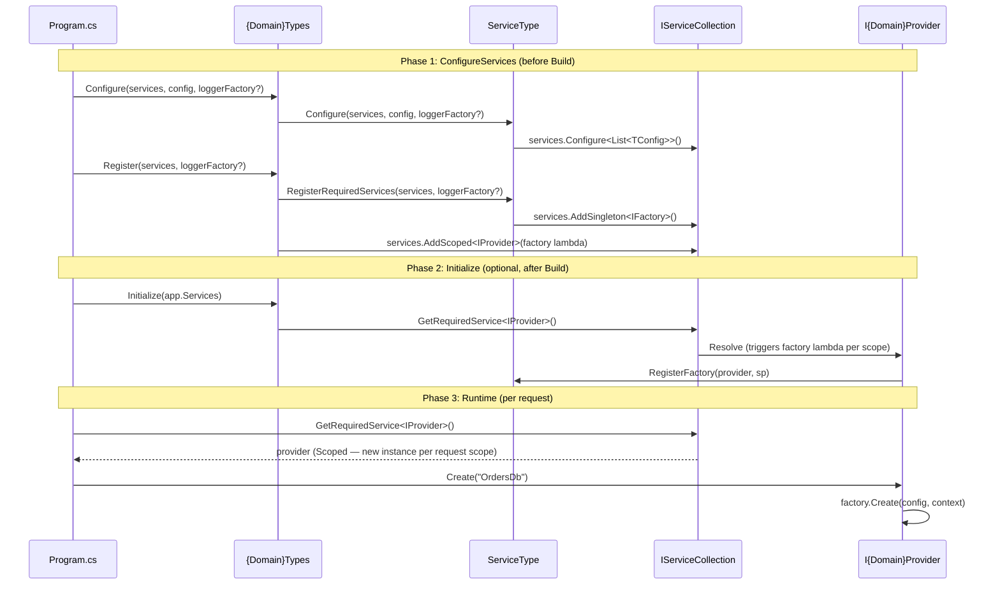

# Service Domains Overview

Service Domains are the plugin architecture for FractalDataWorks services. Each domain (Connections, SecretManagers, Authentication, etc.) follows the same patterns for extensibility, registration, and runtime behavior.

## What is a Service Domain?

A Service Domain is a family of related services that share:
- A common interface (`IGenericConnection`, `ISecretManager`, etc.)
- A factory pattern for creating instances
- Configuration binding from `IConfiguration`
- A provider that acts as a mini-IoC container for the domain
- A `ServiceTypeCollection` for O(1) lookups by name, ID, or other properties

## Core Domains

| Domain | Purpose | Example Implementations |
|--------|---------|------------------------|
| **Connections** | Database and API connections | MsSql, Http |
| **SecretManagers** | Credential storage | AzureKeyVault, EnvironmentVariable, UserSecrets |
| **DataStores** | Physical data storage locations | SqlServer, Rest |
| **Authentication** | Auth providers | Jwt, OAuth2, Basic, ApiKey |
| **Notifications** | Alert channels | Webhook, Console |
| **Transformations** | Data transformations | Calculation, Aggregation, Pivot, Lookup |

## Architecture

```mermaid
graph TB
    subgraph "Abstractions Package"
        Interface[I{Domain}]
        Base[{Domain}Base]
        Factory[I{Domain}Factory]
        Config[I{Domain}Configuration]
        ConfigBase[{Domain}ConfigurationBase]
        Collection[{Domain}Types<br/>ServiceTypeCollection]
        Provider[I{Domain}Provider]
    end

    subgraph "Implementation Package"
        DefaultProvider[Default{Domain}Provider]
        Log[{Domain}Log]
    end

    subgraph "Concrete Package (e.g., MsSql)"
        Type[{Name}Type<br/>ServiceTypeOption]
        ConcreteFactory[{Name}Factory]
        ConcreteConfig[{Name}Configuration]
        ConcreteLog[{Name}Log]
    end

    subgraph "Endpoints Package"
        EndpointBases["{Domain}EndpointBase classes<br/>(generic with open type params)"]
        Dtos["Shared DTOs<br/>(Summary, Detail, Request)"]
    end

    Interface --> Base
    Factory --> Interface
    Config --> ConfigBase
    Collection --> Base
    Provider --> Factory

    DefaultProvider --> Provider

    Type --> Base
    Type --> Collection
    ConcreteFactory --> Factory
    ConcreteConfig --> ConfigBase

    EndpointBases --> Config
    EndpointBases --> Provider
```

### Project Tiers

| Tier | Package Suffix | Contents |
|------|---------------|----------|
| Abstractions | `.Abstractions` | Interfaces, base classes, configuration contracts |
| Implementation | (none) | Provider, collection, registration, logging |
| Concrete | `.{Implementation}` | Type option, factory, config, implementation-specific logging |
| **Endpoints** | `.Endpoints` | Generic base endpoints (FastEndpoints), shared DTOs |

The `.Endpoints` tier is the API surface for each service domain. It provides generic base endpoint classes with open type parameters that consumers close with their concrete types. See [API Endpoints](12-07-API-Endpoints.md) for details.

## Registration Flow



## Consumer Usage

### With Hosting Extensions (Recommended)

The `Fdw.Hosting` and `Fdw.Hosting.MsSql` packages encapsulate the three-phase registration into a fluent builder (see [Creating a Server](12-01-Creating-A-Server.md)):

```csharp
var builder = WebApplication.CreateBuilder(args);

var loggerFactory = builder.AddFrameworkSerilog("MyService");
using var configDb = await builder.AddConfigurationGateway(loggerFactory);

builder.AddFrameworkServiceTypes(loggerFactory, types =>
{
    types.AddSecretManagers()
         .AddConnections()
         .AddDataStores(ds => ds.RegisterMsSql())
         .AddDataSets()
         .AddAuthentication()
         .AddAuthorization()
         .AddDataGateway();
});

var app = builder.Build();
app.InitializeFrameworkServiceTypes(loggerFactory);
app.Run();
```

### Manual Registration (Advanced)

For scenarios where hosting extensions are not used, register each domain individually:

```csharp
var builder = WebApplication.CreateBuilder(args);

// Logger factory, used by the PlatformServices sweep.
var loggerFactory = builder.AddFrameworkSerilog("MyApp");

// Phase 1: Configure and Register — ONE PlatformServices sweep drives every
// [ServiceTypeCollection] discovered by the generated module initializer (SecretManagerTypes,
// AuthenticationServiceTypes, ConnectionTypes, DataStore's ConfigurationGatewayDataStoreProvider, …)
// in dependency-safe Group order. There is no hand-written per-domain Configure/Register list.
PlatformServices.Configure(builder, loggerFactory);
PlatformServices.Register(builder.Services, loggerFactory);

var app = builder.Build();

// Phase 2: Initialize — ONE sweep, same Group order.
PlatformServices.Initialize(app.Services, loggerFactory);

app.Run();
```

> **Note:** For scoped providers, a domain's `Initialize()` is a no-op (kept so the shape is uniform for `[PlatformServiceProvider]`/`[ServiceTypeCollection]` discovery). For singleton-lifetime overrides, `Initialize()` eagerly resolves the singleton from the root container, catching configuration errors at startup rather than on the first request.

**Why Initialize() is still called uniformly:**
- The sweep calls it for every domain regardless of lifetime
- For scoped providers the call succeeds but does nothing; the first real request creates the scope
- For Singleton-overridden providers it resolves the singleton and fires fail-fast validation

## Next Steps

- [Creating a Service Domain](06-02-Creating-Service-Domain.md) - Step-by-step guide
- [Connections Service Domain](06-03-Connections-Service-Domain.md) - Reference implementation with auth processors
- [Transformations Service Domain](06-04-Transformations-Service-Domain.md) - Calculation, Aggregation, Pivot, Lookup
- [Notifications Service Domain](06-05-Notifications-Service-Domain.md) - Webhook and Console channels
- [Creating a Server](12-01-Creating-A-Server.md) - Hosting extensions for three-phase registration
- [API Endpoints](12-07-API-Endpoints.md) - Per-domain endpoint architecture (Endpoints tier)
- [TypeCollections Overview](04-01-Overview.md) - Understanding the base pattern
- [MessageLogging](07-01-Overview.md) - Structured logging pattern
