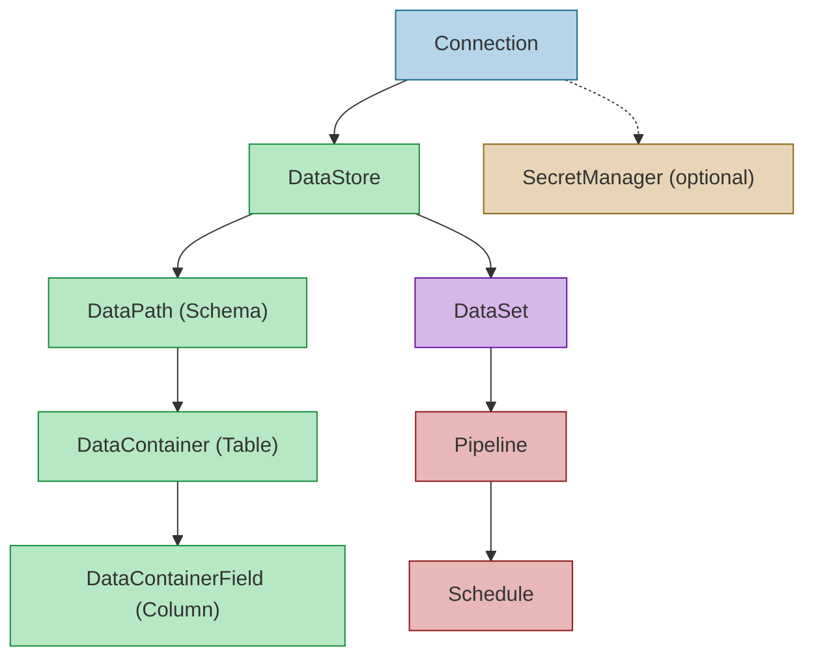

# Configuration Prerequisite Chain

FDW configuration entities form a strict dependency hierarchy. Each entity references its parent, so parent entities must exist before their children can be created. The diagram below shows this prerequisite chain from the most fundamental entity (Connection) through to the scheduling layer.

## What Each Entity Represents

A **Connection** is a physical endpoint -- a database server, REST API, or file system location. It carries the connection type discriminator (MsSql, PostgreSql, Http, etc.) and optionally references a **SecretManager** to resolve credentials at runtime. A **DataStore** is a logical storage grouping accessed through a Connection; the same physical database can appear as multiple DataStores when accessed via different credentials or connection strings. Beneath a DataStore, **DataPath** represents navigation (a SQL schema like `dbo` or `sales`, a REST endpoint path, or a file directory), **DataContainer** represents the physical structure at that path (a table, view, JSON document, or CSV file), and **DataContainerField** captures individual columns or properties with their name, data type, nullability, and ordinal position. A **DataSet** is a logical view over one or more physical sources, decoupling consumers from storage details. **Pipeline** defines an ETL execution plan, and **Schedule** triggers pipeline execution on a cron or interval basis.

## Why the Dependency Chain Matters

Every entity in the chain holds a foreign key to its parent. Attempting to create a DataPath without first creating its DataStore will fail at the database level (FK constraint violation) or at runtime when the framework tries to resolve the dependency. This ordering is not arbitrary -- it mirrors the physical reality of data access. You cannot describe a schema (DataPath) without knowing which database it lives in (DataStore), and you cannot reach that database without connection details (Connection). The chain ensures that by the time a consumer requests data through a DataSet, every layer beneath it has been validated and is resolvable.

## How Discovery Auto-Populates the Chain

For SQL-based connections, the framework provides schema introspection that can auto-populate the lower layers of the chain. After creating a Connection and DataStore manually (or via the Management UI), invoking the discovery process will connect to the target database, enumerate its schemas (creating DataPath entries), discover tables and views within each schema (creating DataContainer entries), and introspect column metadata (creating DataContainerField entries). This means administrators typically only need to create Connection and DataStore records by hand; the rest of the hierarchy is populated automatically through the "Connect, Discover, Auto-Create" workflow exposed in the Management UI's DataStore pages.
