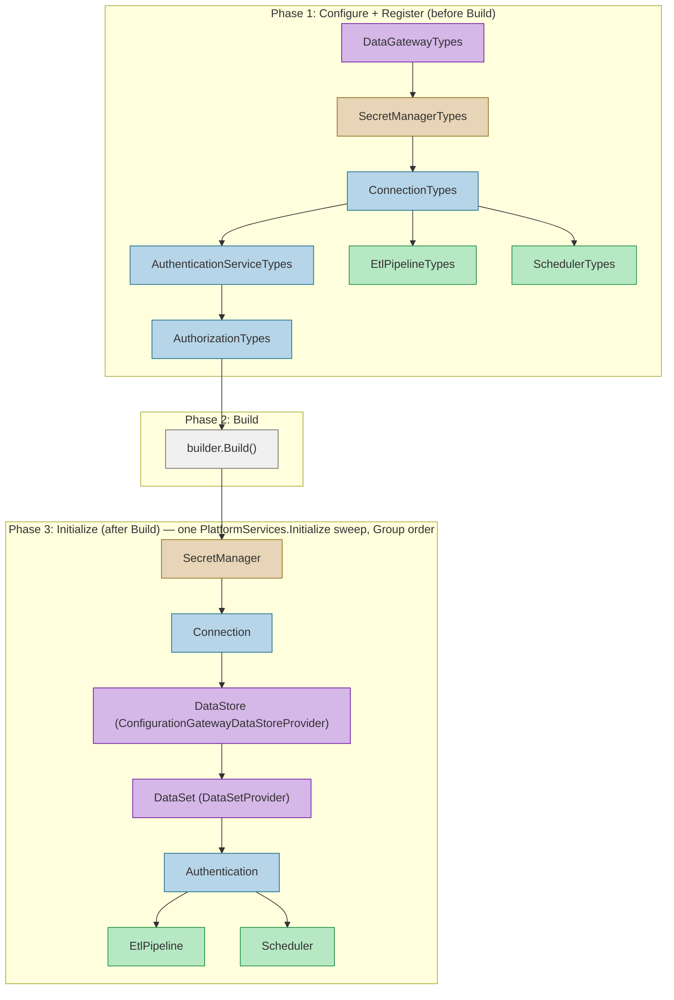

# Service Startup Order

FDW applications follow a strict three-phase startup sequence. Service types must be registered and initialized in dependency order — each phase builds on the previous one, and misordering causes runtime failures.



## The Three-Phase Pattern

Each domain still declares the same three phases; what changed is that the entry-point app no longer
calls them one domain at a time. `PlatformServices.Configure`/`Register`/`Initialize` walk every
discovered domain in dependency-safe **Group** order, so the descriptions below apply *per domain
inside discovery*.

**Phase 1 (Configure + Register)** runs before `builder.Build()`. For each `ServiceTypeCollection`, discovery invokes two methods:

1. `XxxTypes.Configure(builder, loggerFactory)` — binds `IOptions<List<TConfiguration>>` from the database-backed configuration source so each service type's settings are available through DI.
2. `XxxTypes.Register(builder.Services, loggerFactory)` — registers the factories, providers, and DI services each type needs.

Ordering within Phase 1 matters: `DataGatewayTypes` first so subsequent providers can receive `Lazy<IDataGateway>`; `SecretManagerTypes` next because connections need them to resolve passwords; `ConnectionTypes` before any consumer of connections; `AuthenticationServiceTypes` before `AuthorizationTypes` so RBAC policies can reference the auth scheme.

**Phase 2 (Build)** is the standard `builder.Build()` call that freezes the DI container and produces the `WebApplication` instance. No service registrations can happen after this point.

**Phase 3 (Initialize)** runs after Build and before the application starts accepting requests. Each `XxxTypes.Initialize(app.Services, loggerFactory)` eagerly resolves its registered instances from the DI container, validates configuration, and establishes connections. This is the fail-fast gate — if a SecretManager cannot access its vault, if a connection string is invalid, or if authentication keys are missing, the application exits with a structured error code instead of failing on the first request. Initialize follows the same dependency order as Phase 1.

## Canonical Call Shape — one PlatformServices sweep

The per-domain `XxxTypes.Configure`/`Register`/`Initialize` list is gone. A single **PlatformServices
sweep** calls every discovered domain's three phases in dependency-safe order. Each `[ServiceTypeCollection]`
is discovered by the `[ModuleInitializer]` that `Fdw.Services.Registration.SourceGenerators` emits into
the entry-point assembly; hand-written three-phase providers that aren't TypeCollections join discovery by
carrying `[PlatformServiceProvider]` (e.g. `DataSetProvider`, `ConfigurationGatewayDataStoreProvider`,
`RealTimeHubs`).

```csharp
// Lazy<IDataGateway> must be in DI before any provider is registered.
builder.Services.AddSingleton(sp =>
    new Lazy<IDataGateway>(() => sp.GetRequiredService<IDataGateway>()));

// Phase 1: Configure + Register (before Build) — ONE sweep, all domains.
PlatformServices.Configure(builder, loggerFactory);
PlatformServices.Register(builder.Services, loggerFactory);

// Standalone helpers that aren't [ServiceTypeCollection] domains (also Phase 1).
builder.Services.AddFrameworkOperations("OpsDb", builder.Configuration, loggerFactory);
builder.Services.AddFrameworkHealthMonitoring(builder.Configuration);
builder.Services.AddFrameworkDesignerPipelines(builder.Configuration);
builder.Services.AddFrameworkConfigurationWriters(builder.Configuration, loggerFactory);

// Phase 2: Build
var app = builder.Build();

// Phase 3: Initialize (after Build) — ONE sweep, dependency-safe Group order:
// SecretManager → Connection → DataGateway → DataVault → CredentialService → …
//   → DataStore → DataSet → the rest.
PlatformServices.Initialize(app.Services, loggerFactory);

// Post-Build calls that are NOT part of the three-phase shape:
app.MapRealTimeHubs(loggerFactory);                        // hub endpoint mapping (registration is discovered)
// Domains without the generated three-phase shape are still hand-driven, e.g.:
OrchestrationTypes.Initialize(app.Services, loggerFactory);
```

`PlatformServices.Configure`/`Register`/`Initialize` skip any domain flagged `Manual` (a "declared
choice" domain that a host drives out-of-band) and are idempotent for domains a host also touches by
dot-walking its `PlatformServices.<Domain>` entry.

See `reference-api/public/src/Reference.Api/Program.cs` for the canonical complete startup.

## See Also

- [Creating a Server](12-01-Creating-A-Server.md) — full hosting startup walkthrough
- [Hosting Extensions (ServiceTypeExtensions)](../src/Fdw.Hosting/Extensions/ServiceTypeExtensions.cs) — `AddFrameworkOperations`, `AddFrameworkConfigurationWriters`, `AddFrameworkPipelineBackgroundExecutor`, etc.
