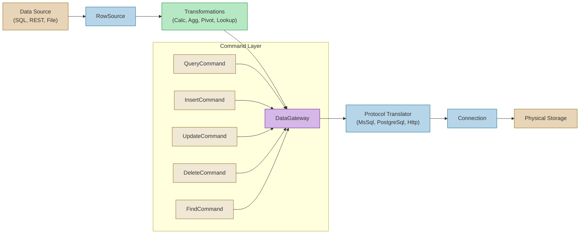

# Data Flow Architecture

Data enters, moves through, and exits the FractalDataWorks platform via a layered pipeline. The architecture separates logical intent (what data to read or write) from physical execution (how to reach the target system), making the same command work identically regardless of whether the target is SQL Server, PostgreSQL, or an HTTP endpoint.

## RowSource: How Data Enters the Platform

A RowSource is the ingestion adapter that reads data from an external system and produces a uniform stream of rows. FDW ships four RowSource implementations: **DataReader** (for SQL result sets via ADO.NET), **Http** (for REST API responses), **Json** (for JSON documents or streams), and **Xml** (for XML documents). Each RowSource normalizes its input into the same tabular representation, so downstream transformations and the DataGateway do not need to know where the data originated. During ETL pipeline execution, a RowSource feeds data into the optional transformation layer -- Calculation, Aggregation, Pivot, and Lookup transforms -- before the results are written to a target via the DataGateway.

## DataGateway: Command Dispatch

The DataGateway is the single entry point for all data operations. API endpoints and ETL stages inject `IDataGateway` directly and submit typed commands: `QueryCommand<T>` for reads, `InsertCommand<T>` for creates, `UpdateCommand<T>` for modifications, `DeleteCommand` for removals, and `FindCommand<T>` for single-entity lookups. Each command specifies a DataStoreName, PathName (schema), and ContainerName (table), but never specifies how to reach the target. The DataGateway resolves the DataStore from the configuration registry, determines which Connection it belongs to, and dispatches the command to the appropriate protocol translator. The translator converts the abstract command into the wire format for the target system -- T-SQL for SQL Server, PostgreSQL-dialect SQL for PostgreSQL, or HTTP requests for REST endpoints.

## Connection-Type Agnostic Design

The critical design property of this architecture is that no code above the connection layer knows or cares about the underlying protocol. A `QueryCommand<Customer>` submitted against a DataStore backed by SQL Server produces a `SELECT` statement; the same command against a DataStore backed by PostgreSQL produces equivalent PostgreSQL syntax; against an HTTP-backed DataStore it produces a GET request. Application code, endpoint logic, and ETL pipeline definitions all work exclusively with the abstract command types and `IDataGateway`. Connection-specific behavior is isolated in the protocol translator and connection implementation projects (`Fdw.Services.Connections.MsSql`, `.PostgreSql`, `.Http`), which are registered at startup through the ServiceTypeCollection pattern and resolved at runtime based on the Connection's type discriminator. See [DataGateway Pattern](05-01-DataGateway-Pattern.md) for the full API reference and usage examples.
